# B29 SMC Auto Controller Workflow

本文按当前程序实现梳理 `b29_smc_auto_controller` 的运行流程。重点覆盖：

- 外层 `RobotFSM` 工作状态。
- controller 每周期命令仲裁顺序。
- 障碍物翻越内部 FSM。
- 脱缆子流程。
- Planner 接管、回夹、人工干预、安全中断。
- 关键函数、变量、转入条件、转出条件和 trace 输出。

## 1. 外层周期入口

主循环入口是 `B29SmcAutoController::update()`。每个控制周期大致顺序如下。

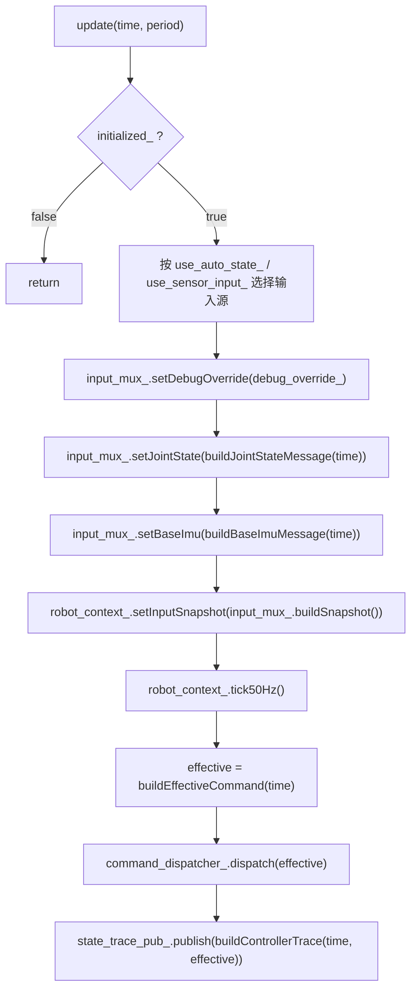

关键含义：

- `robot_context_.tick50Hz()` 负责外层 SMC 状态机 `RobotFSM`。
- `buildEffectiveCommand()` 负责在 `RobotContext` 基础命令之上叠加障碍物翻越逻辑。
- `command_dispatcher_.dispatch(effective)` 是最终写入关节和轮子的动作出口。
- `buildControllerTrace()` 合并 `RobotContext` trace、最终命令 trace、controller 内部状态 trace。

## 2. RobotFSM 外层状态机

外层状态由 `RobotFSM.sm` 定义，当前状态可通过 trace 的 `current_state` 查看。

为了避免单张图过密，外层 `RobotFSM` 拆成三张图。图中只保留短标签，详细函数、条件和变量变化在图后文字说明。

正常启动和运行主线：

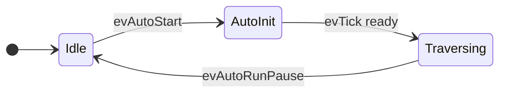

`Traversing` 中 `evTick` 对基础命令的选择：

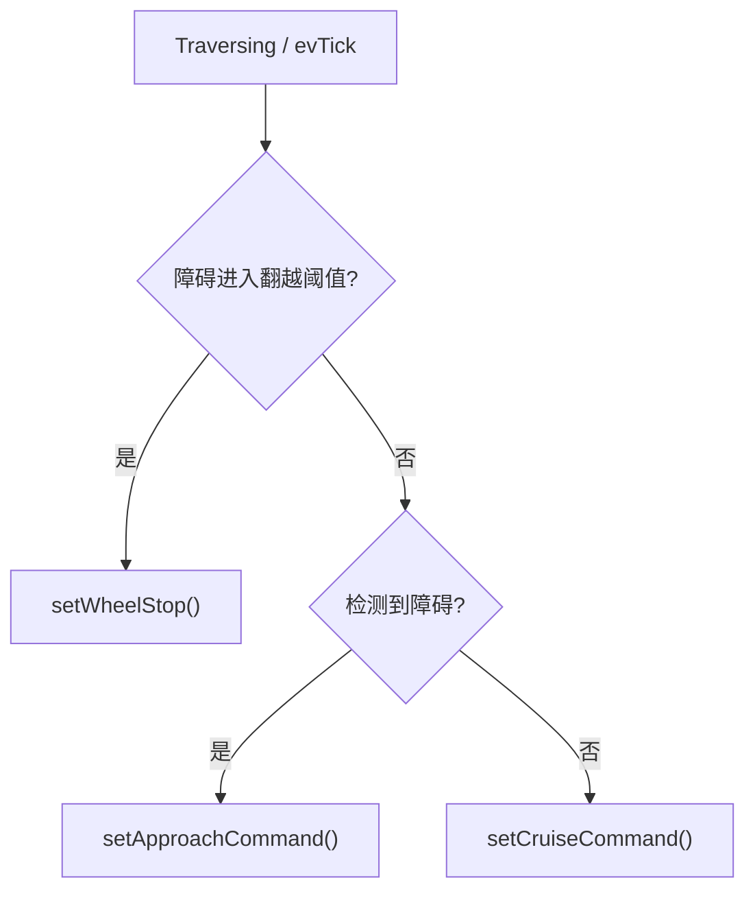

通信、安全故障和恢复路径：

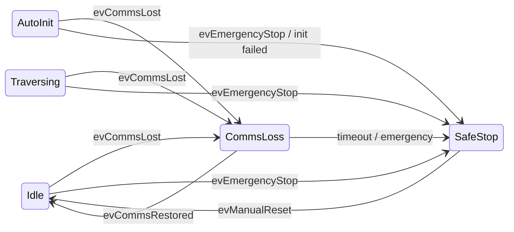

`tick50Hz()` 的调度优先级：

1. `input_.emergency_stop || hasSafetyFault()`：触发 `evEmergencyStop()`，清 `auto_start_requested_`。
2. 当前 `CommsLoss`：若 `input_.lower_alive` 则 `evCommsRestored()`；否则重连计数到 `kReconnectTimeoutTicks` 后 `evReconnectTimeout()`。
3. 当前 `AutoInit`：若 `isReadyToTraverse()` 则 `evTick()` 进入 `Traversing`；否则初始化计数到 `kAutoInitTimeoutTicks` 后 `evInitFailed()`。
4. 非 `CommsLoss` 且 `!input_.lower_alive`：触发 `evCommsLost()`。
5. 当前 `SafeStop`：若 `manual_reset_requested` 则 `evManualReset()`。
6. 当前 `Idle && auto_start_requested_`：触发 `evAutoStart()`。
7. 当前 `Traversing && input_.auto_run_pause`：触发 `evAutoRunPause()`。
8. 其他情况：触发 `evTick()`。

## 3. 最终命令仲裁

`buildEffectiveCommand()` 是最终命令叠加入口。

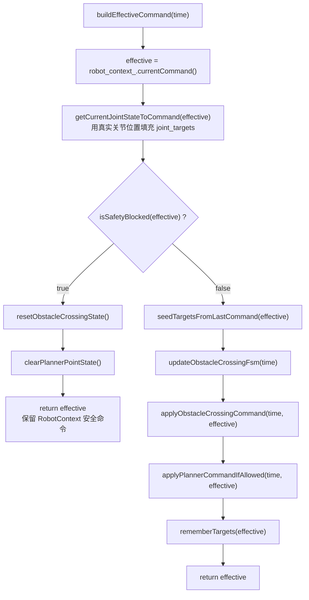

安全阻断条件：

- `robot_context_.isSafeStop()`
- `robot_context_.isCommsLoss()`
- `effective.freeze_joints == true`

安全阻断触发后修改变量：

- `obstacle_crossing_stage_ = Idle`
- `crossing_side_ = None`
- `first_crossing_side_ = Left`
- `failed_action_ = None`
- `disconnect_cable_step_ = Idle`
- `planner_take_control_time_ = ros::Time{}`
- `gripper_wait_start_time_ = ros::Time{}`
- `to_check_joint_pos_ = 0.0`
- `has_last_effective_joint_targets_ = false`
- `motion_segment_ = MotionSegment{}`
- 全部 retry 计数清零
- `latest_planner_point_` / `last_accepted_planner_point_` 清空
- `has_latest_planner_point_ = false`
- `has_last_accepted_planner_point_ = false`

## 4. 障碍物翻越主 FSM

内部状态变量：

- `obstacle_crossing_stage_`
- `crossing_side_`
- `first_crossing_side_`
- `failed_action_`
- `disconnect_cable_step_`

为了提高可读性，主 FSM 拆成“正常路径”“失败进入人工干预”“人工干预恢复映射”三张图。图中使用短状态名，完整状态名、函数名和变量变化在后续小节展开。

正常翻越路径：

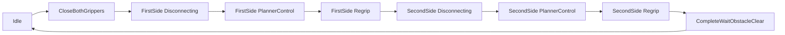

自动失败和 retry 路径：

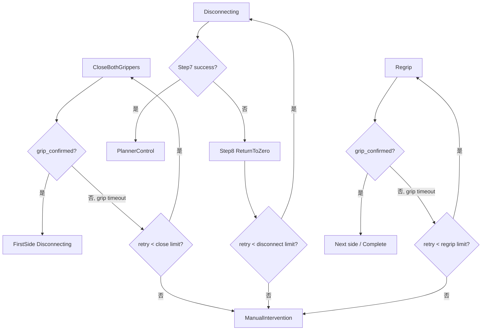

人工干预恢复映射：

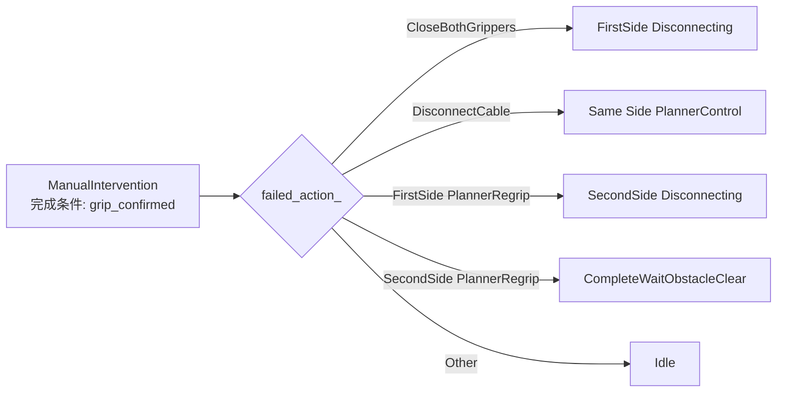

### 4.1 Idle

进入条件：

- 初始化默认状态。
- `CompleteWaitObstacleClear` 中障碍消失后调用 `resetObstacleCrossingState()`。
- 安全阻断时调用 `resetObstacleCrossingState()`。

转出条件：

- `robot_context_.isTraversing() == true`
- `robot_context_.isObstacleWithinCrossObstaclesDistance() == true`

转出动作：

- `resetRetryCounts()`
- `resetMotionSegment()`
- `failed_action_ = None`
- `first_crossing_side_ = firstCrossingSideFromCruiseSpeed()`
- `crossing_side_ = first_crossing_side_`
- `disconnect_cable_step_ = Idle`
- `obstacle_crossing_stage_ = CloseBothGrippers`
- `gripper_wait_start_time_ = time`

首侧选择：

- `robot_context_.getCruiseSpeed() < 0.0`：`first_crossing_side_ = Right`
- 其他情况：`first_crossing_side_ = Left`

命令行为：

- 若外层处于 `Traversing`，两个夹爪目标置为 `HALFOPEN`。

### 4.2 CloseBothGrippers

目的：

- 障碍进入阈值后，先闭合两个夹爪，确认线缆被夹紧，禁止轮子运动。

命令行为：

- `stopWheels(effective, "crossing_close_grippers")`
- `LeftGripper = CLOSED`
- `RightGripper = CLOSED`
- `drive_mode = Stop`
- `left_wheel_speed = 0.0`
- `right_wheel_speed = 0.0`
- `stop_all = true`
- `freeze_joints = false`

成功转出：

- 条件：`robot_context_.isGripConfirmed() == true`
- 动作：
  - `close_grippers_retry_count_ = 0`
  - `enterDisconnecting(first_crossing_side_)`

失败重试：

- 条件：等待超过 `robot_motion_config_.wait_for_grip_respond_time` 且 `close_grippers_retry_count_ < robot_motion_config_.close_gripper_retry_limit`
- 动作：
  - `++close_grippers_retry_count_`
  - `gripper_wait_start_time_ = time`

进入人工干预：

- 条件：等待超过 `robot_motion_config_.wait_for_grip_respond_time` 且 `close_grippers_retry_count_ >= robot_motion_config_.close_gripper_retry_limit`
- 函数：`enterManualIntervention(CloseBothGrippers, first_crossing_side_)`

### 4.3 Disconnecting

目的：

- 对当前 `crossing_side_` 执行脱缆流程。

命令行为：

- `stopWheels(effective, "disconnect_<side>_active")`
- 调用 `updateDisconnectCableStep(time, effective)`
- 当前侧夹爪目标设为 `OPEN`

成功转出：

- 条件：脱缆 Step7 检测成功。
- 函数：`enterPlannerControl(time, crossing_side_)`

失败重试：

- 条件：Step8 回零完成后进入 `Failed`，且当前侧 disconnect retry 小于 `robot_motion_config_.disconnect_cable_retry_limit`。
- 动作：
  - `++left_disconnect_retry_count_` 或 `++right_disconnect_retry_count_`
  - `resetMotionSegment()`
  - `disconnect_cable_step_ = Step1LoosenGripper`

进入人工干预：

- 条件：当前侧 disconnect retry 达到 `robot_motion_config_.disconnect_cable_retry_limit`
- 函数：`enterManualIntervention(DisconnectCable, crossing_side_)`

### 4.4 PlannerControl

目的：

- 脱缆成功后，让 Planner 在固定时间内接管四个腿部关节目标。

进入函数：

- `enterPlannerControl(time, side)`

进入时修改变量：

- `obstacle_crossing_stage_ = PlannerControl`
- `crossing_side_ = side`
- `planner_take_control_time_ = time`
- `disconnect_cable_step_ = Idle`
- `resetMotionSegment()`

命令行为：

- 先 `stopWheels(effective, "planner_<side>_wait")`
- 再由 `applyPlannerCommandIfAllowed()` 判断是否覆盖四个腿部关节。

Planner 覆盖条件：

- `obstacle_crossing_stage_ == PlannerControl`
- `latestPlannerPointIsFresh(time, point) == true`

Planner 覆盖关节：

- `LeftFirstLeg = point.left_first`
- `LeftSecondLeg = point.left_second`
- `RightFirstLeg = point.right_first`
- `RightSecondLeg = point.right_second`

不覆盖内容：

- 不覆盖夹爪。
- 不覆盖轮子。
- 不在非 `PlannerControl` 阶段接管。

转出条件：

- `(time - planner_take_control_time_) >= robot_motion_config_.wait_for_planner_point_control_time`

转出动作：

- `obstacle_crossing_stage_ = Regrip`
- `gripper_wait_start_time_ = time`

### 4.5 Regrip

目的：

- Planner 接管结束后，当前侧重新夹紧线缆。

命令行为：

- `stopWheels(effective, "regrip_<side>_wait")`
- `current side gripper = CLOSED`

首侧成功：

- 条件：`isGripConfirmed() == true && crossing_side_ == first_crossing_side_`
- 动作：
  - 清零当前侧 regrip retry
  - `enterDisconnecting(oppositeCrossingSide(crossing_side_))`

第二侧成功：

- 条件：`isGripConfirmed() == true && crossing_side_ != first_crossing_side_`
- 动作：
  - 清零当前侧 regrip retry
  - `obstacle_crossing_stage_ = CompleteWaitObstacleClear`
  - `crossing_side_ = None`
  - `disconnect_cable_step_ = Idle`
  - `resetMotionSegment()`

失败重试：

- 条件：等待超过 `robot_motion_config_.wait_for_grip_respond_time` 且当前侧 regrip retry 小于 `robot_motion_config_.planner_regrip_retry_limit`。
- 动作：
  - `++left_regrip_retry_count_` 或 `++right_regrip_retry_count_`
  - `gripper_wait_start_time_ = time`

进入人工干预：

- 条件：当前侧 regrip retry 达到 `robot_motion_config_.planner_regrip_retry_limit`
- 函数：`enterManualIntervention(PlannerRegrip, crossing_side_)`

### 4.6 CompleteWaitObstacleClear

目的：

- 左右两侧均完成脱缆、Planner 接管和回夹后，恢复巡航基础命令，但等待障碍检测消失，防止同一个障碍重复触发。

命令行为：

- `drive_mode = Forward`
- `left_wheel_speed = robot_context_.getCruiseSpeed()`
- `right_wheel_speed = robot_context_.getCruiseSpeed()`
- `stop_all = false`
- `freeze_joints = false`
- `LeftGripper = HALFOPEN`
- `RightGripper = HALFOPEN`
- `command_reason = "crossing_complete_wait_obstacle_clear"`

转出条件：

- `robot_context_.isObstacleDetected() == false`

转出动作：

- `resetObstacleCrossingState()`

### 4.7 ManualIntervention

目的：

- 自动动作失败达到 retry 上限后，停止轮子，停止 Planner/脱缆覆盖，等待人工处理。

进入函数：

- `enterManualIntervention(action, side)`

进入时修改变量：

- `obstacle_crossing_stage_ = ManualIntervention`
- `crossing_side_ = side`
- `failed_action_ = action`
- `disconnect_cable_step_ = Idle`
- `resetMotionSegment()`
- `clearPlannerPointState()`

命令行为：

- `stopWheels(effective, "manual_intervention_<failed_action>")`
- 由于 `seedTargetsFromLastCommand()` 排除了 `ManualIntervention`，且每周期先调用 `getCurrentJointStateToCommand()`，人工干预期间关节目标默认跟随真实反馈位置。

完成条件：

- `robot_context_.isGripConfirmed() == true`

退出前清理：

- `clearRetryForAction(action, side)`
- `failed_action_ = None`
- `resetMotionSegment()`
- `disconnect_cable_step_ = Idle`

失败动作到下一阶段的映射：

| failed_action_ | crossing_side_ | 人工确认后进入 | 触发函数 / 变量变化 |
|---|---|---|---|
| `CloseBothGrippers` | `first_crossing_side_` | `FirstSide Disconnecting` | `enterDisconnecting(first_crossing_side_)` |
| `DisconnectCable` | `Left` | `Left PlannerControl` | `enterPlannerControl(time, Left)` |
| `DisconnectCable` | `Right` | `Right PlannerControl` | `enterPlannerControl(time, Right)` |
| `PlannerRegrip` | `first_crossing_side_` | `SecondSide Disconnecting` | `enterDisconnecting(oppositeCrossingSide(crossing_side_))` |
| `PlannerRegrip` | 第二侧 | `CompleteWaitObstacleClear` | `obstacle_crossing_stage_ = CompleteWaitObstacleClear`; `crossing_side_ = None` |
| 其他 | 任意 | `Idle` | `resetObstacleCrossingState()` |

## 5. 脱缆子流程

脱缆步骤变量是 `disconnect_cable_step_`。

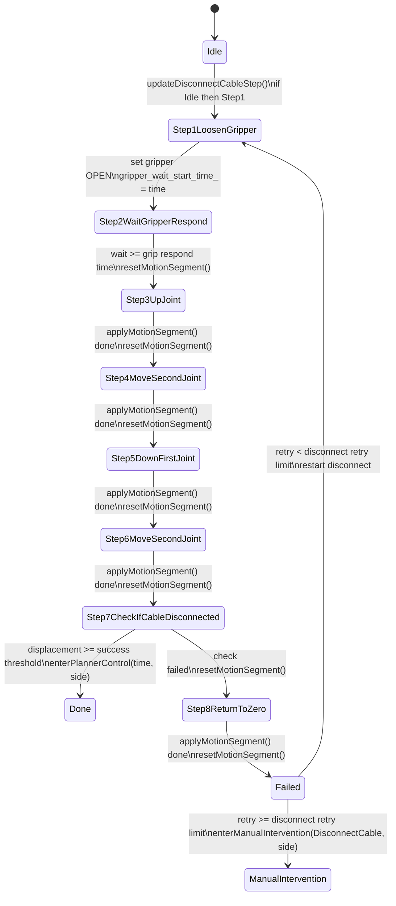

脱缆步骤命令细节：

| Step | command_reason | 动作 | 关键变量 |
|---|---|---|---|
| `Step1LoosenGripper` | `disconnect_<side>_step1_loosen_gripper` | 当前侧夹爪 `OPEN` | `gripper_wait_start_time_ = time`; step -> `Step2WaitGripperRespond` |
| `Step2WaitGripperRespond` | `disconnect_<side>_step2_wait_gripper` | 等待夹爪响应 | 超过 `robot_motion_config_.wait_for_grip_respond_time` 后 step -> `Step3UpJoint` |
| `Step3UpJoint` | `disconnect_<side>_step3_up_joint` | 第一关节插值到 `robot_motion_config_.disconnect_cable_up_joint_position` | `applyMotionSegment()` |
| `Step4MoveSecondJoint` | `disconnect_<side>_step4_move_second_joint` | 第二关节插值到 `robot_motion_config_.disconnect_cable_move_joint_position` | `applyMotionSegment()` |
| `Step5DownFirstJoint` | `disconnect_<side>_step5_down_first_joint` | 第一关节插值到 `robot_motion_config_.disconnect_cable_down_joint_position` | `applyMotionSegment()` |
| `Step6MoveSecondJoint` | `disconnect_<side>_step6_move_second_joint` | 第二关节从步骤起点相对 `robot_motion_config_.disconnect_cable_second_joint_check_delta` | 记录 `to_check_joint_pos_ = 当前第二关节反馈位置` |
| `Step7CheckIfCableDisconnected` | `disconnect_<side>_step7_check_disconnect` | 检测脱缆是否成功 | 判断 `abs(current_pos - to_check_joint_pos_) >= robot_motion_config_.succeed_disconnect_cable_threshold` |
| `Step8ReturnToZero` | `disconnect_<side>_step8_return_to_zero` | 第一和第二关节插值回 `0.0` | 完成后 step -> `Failed` |
| `Failed` | 沿用上一帧或由上层覆盖 | 增加当前侧 retry | 小于 `robot_motion_config_.disconnect_cable_retry_limit` 重试；达到上限进人工干预 |

当前侧与实际动作关节映射：

| crossing_side_ | `jointsForCrossingSide().gripper` | `jointsForCrossingSide().actuator_first_leg` | `jointsForCrossingSide().actuator_second_leg` |
|---|---|---|---|
| `Left` | `LeftGripper` | `RightFirstLeg` | `RightSecondLeg` |
| `Right` | `RightGripper` | `LeftFirstLeg` | `LeftSecondLeg` |

注意：当前实现是对“当前检查侧”打开夹爪，但脱缆动作关节使用对侧腿部关节。

异常兜底：

- 正常流程不会以 `CrossingSide::None` 调用侧名或关节映射函数。
- 当前 `sideReasonName(None)` 返回 `"left"`。
- 当前 `jointsForCrossingSide(None)` 返回表中第一项，即左夹爪与右腿映射。
- 上述返回值只用于防御性兜底，不应视为有效业务路径。

## 6. 动作平滑机制

`Step3`、`Step4`、`Step5`、`Step6`、`Step8` 使用 `applyMotionSegment()` 平滑插值。

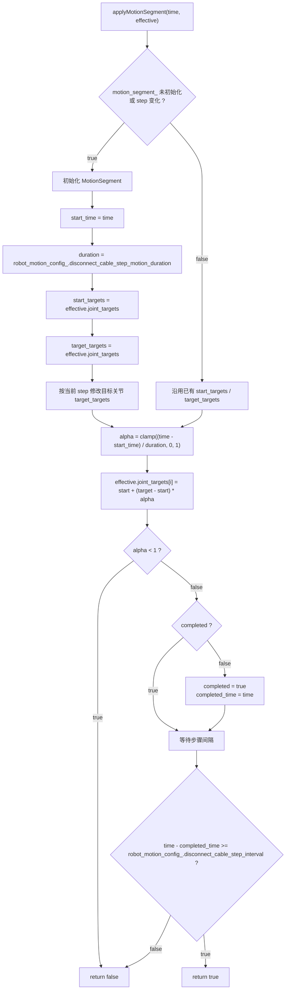

平滑程度由以下配置参数控制：

- `robot_motion_config_.disconnect_cable_step_motion_duration`：插值运动时间，越大越慢越平滑。
- `robot_motion_config_.disconnect_cable_step_interval`：插值到目标后停留多久才进入下一步。

## 7. Planner 输入接收与应用

Planner 输入通过 `plannerInputCallback()` 接收。

接收条件：

- `planner_input_enabled_ == true`
- `msg != nullptr`
- `validatePlannerPoint()` 成功

校验规则：

- `data.size() == 4`
- 四个数均为 finite。
- 若已有上一个 accepted point，每周期增量不超过 `planner_point_max_delta_per_cycle_`。

接收成功后修改变量：

- `latest_planner_point_ = point`
- `last_accepted_planner_point_ = point`
- `has_latest_planner_point_ = true`
- `has_last_accepted_planner_point_ = true`
- `point.stamp = ros::Time::now()`

应用条件：

- 只在 `obstacle_crossing_stage_ == PlannerControl`。
- `latestPlannerPointIsFresh(time, point)` 成功。
- 若 point 超过 `planner_point_timeout_`，会清空 latest/accepted point，并本周期不应用 Planner 点。

## 8. Trace 输出

`buildControllerTrace()` 输出顺序：

1. `robot_context_.buildTraceMessage(stamp)`
2. `applyCommandToTrace(command, trace)`
3. `applyControllerStateToTrace(stamp, command, trace)`

controller 追加的 trace 字段：

| trace 字段 | 来源变量 / 函数 |
|---|---|
| `obstacle_crossing_active` | `obstacle_crossing_stage_ != Idle` |
| `obstacle_crossing_stage` | `stageName(obstacle_crossing_stage_)` |
| `obstacle_crossing_side` | `sideName(crossing_side_)` |
| `disconnect_step` | `disconnectStepName(disconnect_cable_step_)` |
| `manual_intervention_active` | `obstacle_crossing_stage_ == ManualIntervention` |
| `manual_intervention_reason` | `"manual_intervention_" + actionReasonName(failed_action_)`，仅人工干预中有效 |
| `failed_action` | `actionName(failed_action_)` |
| `retry_count` | `currentRetryCount()` |

命令 trace 来自 `applyCommandToTrace()`：

- `command_reason`
- `stop_all`
- `freeze_joints`
- `left_wheel_speed`
- `right_wheel_speed`
- `crossing_strategy`

## 9. Retry 计数

| 动作 | 计数变量 | 上限 | 成功清零位置 |
|---|---|---|---|
| 双夹爪闭合 | `close_grippers_retry_count_` | `robot_motion_config_.close_gripper_retry_limit` | `CloseBothGrippers` 中 `isGripConfirmed()` 成功 |
| 左脱缆 | `left_disconnect_retry_count_` | `robot_motion_config_.disconnect_cable_retry_limit` | Step7 成功且 `crossing_side_ == Left` |
| 右脱缆 | `right_disconnect_retry_count_` | `robot_motion_config_.disconnect_cable_retry_limit` | Step7 成功且 `crossing_side_ == Right` |
| 左回夹 | `left_regrip_retry_count_` | `robot_motion_config_.planner_regrip_retry_limit` | `Regrip` 中左侧 `isGripConfirmed()` 成功 |
| 右回夹 | `right_regrip_retry_count_` | `robot_motion_config_.planner_regrip_retry_limit` | `Regrip` 中右侧 `isGripConfirmed()` 成功 |

额外清零场景：

- 新障碍流程触发时：`resetRetryCounts()`。
- 安全阻断时：`resetObstacleCrossingState()` 内部调用 `resetRetryCounts()`。
- 人工干预退出时：`clearRetryForAction(action, side)` 只清导致人工干预的动作对应 retry。

## 10. 关键状态变量总表

| 变量 | 类型 | 作用 |
|---|---|---|
| `obstacle_crossing_stage_` | `ObstacleCrossingStage` | 障碍翻越主状态 |
| `crossing_side_` | `CrossingSide` | 当前处理侧：`Left` / `Right` / `None` |
| `first_crossing_side_` | `CrossingSide` | 本次越障首侧，由巡航速度符号确定，并决定 FirstSide / SecondSide 顺序 |
| `failed_action_` | `CrossingAction` | 进入人工干预的失败动作 |
| `disconnect_cable_step_` | `DisconnectCableStep` | 脱缆子步骤 |
| `planner_take_control_time_` | `ros::Time` | Planner 接管起始时间 |
| `gripper_wait_start_time_` | `ros::Time` | 夹爪等待或重试计时起点 |
| `to_check_joint_pos_` | `double` | Step6 开始时第二关节反馈位置，用于 Step7 判断脱缆位移 |
| `motion_segment_` | `MotionSegment` | 插值动作状态 |
| `last_effective_joint_targets_` | `array<double, 6>` | 非人工干预阶段保持上一帧目标，避免每帧从反馈重置动作起点 |
| `has_last_effective_joint_targets_` | `bool` | 上一帧目标是否有效 |
| `latest_planner_point_` | `PlannerJointPoint` | 最新 Planner 点 |
| `last_accepted_planner_point_` | `PlannerJointPoint` | 上一个通过校验的 Planner 点，用于 delta 限制 |
| `has_latest_planner_point_` | `bool` | 是否有可用 Planner 点 |
| `has_last_accepted_planner_point_` | `bool` | 是否有上一 Planner 点 |

### 10.1 参数来源与加载

`loadParameters()` 从 controller namespace 读取：

- `posture_roll_limit` -> `input_mux_config_.max_abs_roll_rad`
- `posture_pitch_limit` -> `input_mux_config_.max_abs_pitch_rad`
- `robot_motion/...` -> `robot_motion_config_`

姿态阈值校验通过后，通过 `input_mux_ = AutoInputMux(input_mux_config_)` 应用到输入检查逻辑。

当前 launch 加载关系：

- `start.launch`、`start_in_gazebo.launch`、`start_smc_in_gazebo.launch`：从 `b29_control/config/controller.yaml` 读取 `robot_motion`。
- `start_in_empty_gazebo.launch`：加载 `controller.yaml` 后再加载 `obstacle_crossing.yaml`，后者会覆盖同名参数。

`controller.yaml` 和 `obstacle_crossing.yaml` 当前包含重复的 `robot_motion` 配置。修改越障参数时需要同步两处，或在后续配置整理中统一保留一个来源。

## 11. 命令原因字符串

当前障碍流程中可能写入的 `command_reason`：

- `crossing_close_grippers`
- `disconnect_left_active`
- `disconnect_right_active`
- `disconnect_left_step1_loosen_gripper`
- `disconnect_right_step1_loosen_gripper`
- `disconnect_left_step2_wait_gripper`
- `disconnect_right_step2_wait_gripper`
- `disconnect_left_step3_up_joint`
- `disconnect_right_step3_up_joint`
- `disconnect_left_step4_move_second_joint`
- `disconnect_right_step4_move_second_joint`
- `disconnect_left_step5_down_first_joint`
- `disconnect_right_step5_down_first_joint`
- `disconnect_left_step6_move_second_joint`
- `disconnect_right_step6_move_second_joint`
- `disconnect_left_step7_check_disconnect`
- `disconnect_right_step7_check_disconnect`
- `disconnect_left_step8_return_to_zero`
- `disconnect_right_step8_return_to_zero`
- `planner_left_wait`
- `planner_right_wait`
- `planner_left_control`
- `planner_right_control`
- `regrip_left_wait`
- `regrip_right_wait`
- `manual_intervention_close_both_grippers`
- `manual_intervention_disconnect_cable`
- `manual_intervention_planner_regrip`
- `crossing_complete_wait_obstacle_clear`

## 12. 一次完整成功路径

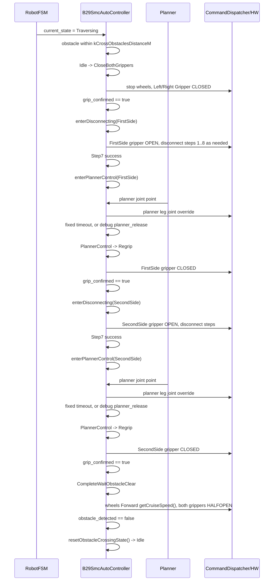

## 13. 安全中断路径

任何周期只要 `buildEffectiveCommand()` 看到安全阻断条件为真，障碍翻越内部流程立即清空。

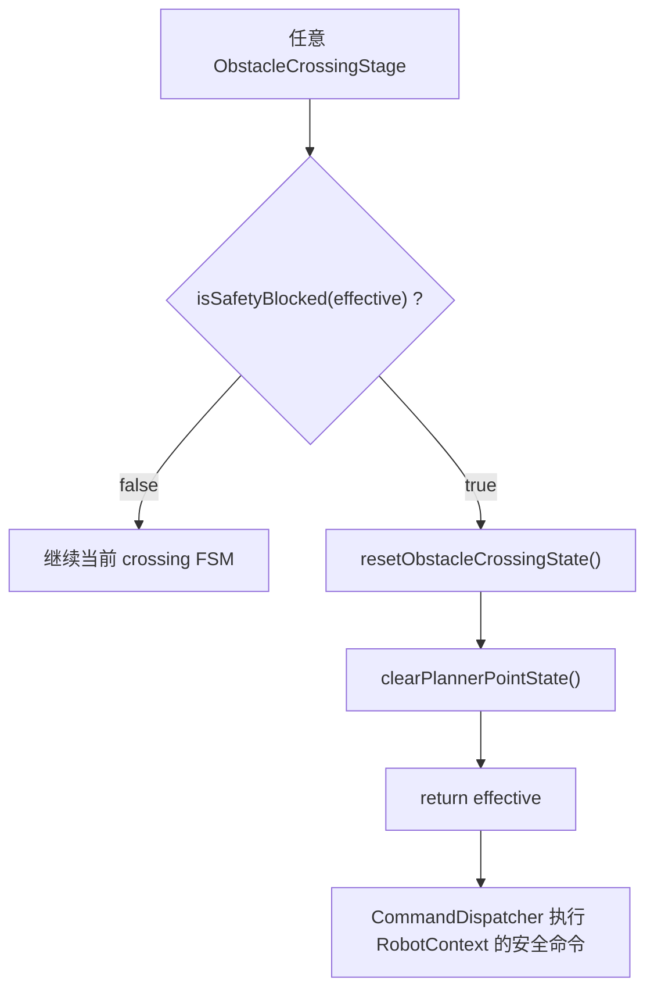

安全阻断来源：

- 外层 `RobotFSM` 进入 `SafeStop`。
- 外层 `RobotFSM` 进入 `CommsLoss`。
- `RobotContext` 命令中 `freeze_joints == true`。

这里不会继续执行 Planner 接管、脱缆插值或人工干预恢复映射。

## 14. 调试验证模式

正式流程默认关闭调试覆盖：

```yaml
debug_validation:
  enabled: false
  simulation_only: false
planner_control:
  manual_release_enabled: false
```

Gazebo 专用 overlay 会显式启用调试模式。`debug_validation/enabled=false` 时，controller 收到 `debug_override` 也会忽略，不会污染正式输入。

PlannerControl 有两种退出方式：

- 正式默认：等待 `robot_motion/wait_for_planner_point_control_time` 后自动进入 `Regrip`。
- 调试手动门禁：`planner_control/manual_release_enabled=true` 时无限等待 `planner_release` 服务，每次进入 PlannerControl 都清除旧 release。

新增服务：

```text
/b29_controller/b29_smc_auto_controller/planner_release
/b29_controller/b29_smc_auto_controller/software_emergency_stop
/b29_controller/b29_smc_auto_controller/manual_reset
```

新增 trace 包含：

- 主 FSM 和脱缆 Step 的进入时间、持续时间、转换原因
- Step7 位移判断值、阈值、检查起点
- 五组 retry 计数和三组上限
- Planner 点 available/fresh、是否实际覆盖 effective targets
- 六关节 effective targets、夹爪目标、dispatch 尝试结果
- 调试门禁、软件急停锁存和 RobotContext 输入快照

完整操作命令见：

```text
b29_control/docs/b29_smc_obstacle_crossing_debug_validation.md
```
