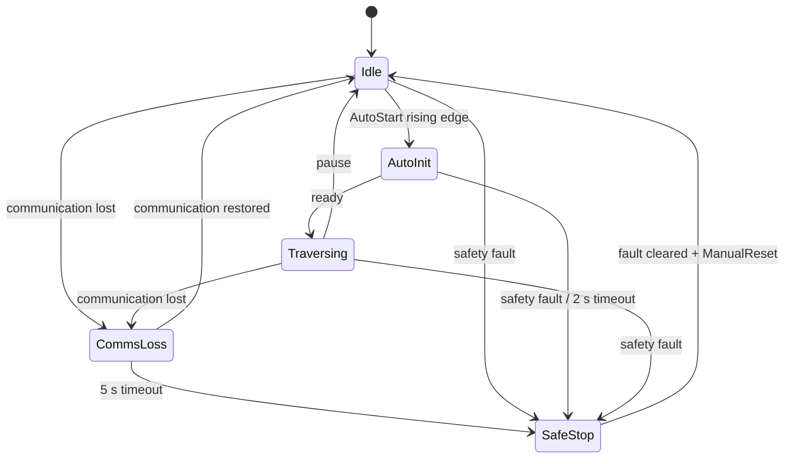

# B29 越障状态机流程

本文是越障逻辑的技术参考。先阅读本包 [`README.md`](README.md)，再用本文查询具体阶段和转换条件。

## 1. 每个控制周期做什么

入口是 `B29SmcAutoController::update(time, period)`：

```text
读取硬件或 sensor_input
  -> AutoInputMux 合并输入
  -> RobotContext::tick(period) 推进外层 RobotFSM
  -> buildEffectiveCommand() 叠加越障和 Planner 命令
  -> CommandDispatcher::dispatch() 写入句柄
  -> publishControllerTrace() 发布状态
```

重要原则：

- `buildEffectiveCommand()` 是唯一最终命令仲裁入口。
- `CommandDispatcher::dispatch()` 是唯一动作出口。
- `state_trace` 在 dispatch 后发布，表示本周期最终命令和内部状态。
- `use_auto_state` 与 `use_sensor_input` 必须恰好启用一个。

## 2. 外层 RobotFSM



`RobotContext::tick(period)` 的实际优先级：

1. 急停、关节/夹爪故障或 `imu_ready=false`。
2. 已处于 CommsLoss 时处理恢复或超时。
3. 已处于 AutoInit 时处理就绪或超时。
4. 其他运行状态检测 `lower_alive=false`。
5. SafeStop 中处理 ManualReset。
6. Idle 中处理 AutoStart。
7. Traversing 中处理 Pause。
8. 普通 tick。

因此 AutoInit 期间单独通信丢失会走初始化超时并进入 SafeStop，而不是进入 CommsLoss。

## 3. 最终命令仲裁

`buildEffectiveCommand()` 的简化顺序：

```text
RobotContext 基础命令
  -> 填充当前关节反馈
  -> 安全阻断检查
  -> 继承上周期有效目标
  -> 推进越障运行时
  -> 应用越障命令
  -> 应用 Planner 点
  -> 保存本周期目标
```

安全阻断条件：

```text
SafeStop || CommsLoss || freeze_joints
```

阻断后会撤销 Planner 权限，清空越障、脱缆、RemoteControl 和临时目标状态。重力补偿是否关闭由越障安全锁存语义决定，不能仅根据 `safe_hold` 或 SafeStop 推断。

## 4. 完整越障流程

当前侧表示要张开的夹爪侧：

| 当前侧 | 张开夹爪 | 脱缆执行关节 | 重力补偿 |
|---|---|---|---|
| `Left` | 左夹爪 | 右一关节 | 右一关节 |
| `Right` | 右夹爪 | 左一关节 | 左一关节 |

首侧由下位机反馈帧中最近一次非零的 `cruise_drive_request` 决定：

- `Forward (1)`：先 Left，前臂作为锁定臂。
- `Reverse (2)`：先 Right，前臂作为锁定臂。
- `Stop (0)` 或非法值：不覆盖已记住的方向；若从未收到非零方向则保持 `Idle`。

轮位置累计值只保留用于 trace 和黑匣子诊断，不参与首侧选择。

```mermaid
flowchart LR
  I[Idle] --> O1[Open Gripper]
  O1 --> G1[Enable Gravity]
  G1 --> D1[Disconnecting]
  D1 --> W1[Wait Flip]
  W1 --> P1[PlannerControl]
  P1 --> R1[RemoteControl]
  R1 --> C1[Regrip]
  C1 --> O2[Other Side Open]
  O2 --> G2[Enable Gravity]
  G2 --> D2[Disconnecting]
  D2 --> W2[Wait Flip]
  W2 --> P2[PlannerControl]
  P2 --> R2[RemoteControl]
  R2 --> C2[Regrip]
  C2 --> CW[Complete Wait Clear]
  CW --> I
```



越障上升沿只在外层 `Traversing` 且越障运行时为 Idle 时生效。信号必须保持为高，直到完成等待阶段再产生下降沿。

## 5. 阶段转换表

| 阶段 | 主要命令 | 进入下一阶段的条件 |
|---|---|---|
| `Idle` | Traversing 时夹爪 `HALFOPEN` | 新越障上升沿 |
| `OpenGripperBeforeGravityCompensation` | 停轮；当前侧 `OPEN`；另一侧 `CLOSED`；补偿关闭 | 等待 `wait_for_grip_respond_time` |
| `EnableGravityCompensation` | 保持夹爪；开启对侧第一关节补偿 | 命令下发一个控制周期 |
| `Disconnecting` | 停轮；执行 Step3、Step5、Step7 | Step7 速度稳定 |
| `DisconnectDoneWaitFlip` | 保持当前目标、夹爪打开和补偿 | normal 模式收到 `start_flip` |
| `PlannerControl` | Planner 可覆盖四腿关节 | 正式完成握手或 debug release |
| `RemoteControl` | 下位机增量控制四腿关节 | 当前阶段新的完成上升沿 |
| `Regrip` | 当前侧夹爪 `CLOSED` | 当前阶段新的 `grip_confirmed false -> true` |
| `ReopenBeforeRemoteControl` | 当前侧夹爪重新 `OPEN` | 固定夹爪等待结束 |
| `CompleteWaitObstacleClear` | 夹爪 `HALFOPEN`；补偿关闭；允许巡航 | 当前阶段新的越障下降沿 |
| `ManualIntervention` | 停轮，停止自动覆盖 | 按失败类型恢复或保持 |

`CloseBothGrippers` 仍保留在枚举和 trace 中，但当前自动入口不使用。

## 6. 脱缆子流程

生产路径在外层完成夹爪张开，因此 `DisconnectCableProcess::start()` 直接从 Step3 开始：

```text
Step3UpFirstJoint
  -> Step5DownFirstJoint
  -> Step7CheckIfCableDisconnected
  -> Done
```

| Step | 动作 | 完成条件 |
|---|---|---|
| `Step3UpFirstJoint` | 第一关节平滑移动到 up 目标 | 插值结束 |
| `Step5DownFirstJoint` | 第一关节平滑移动到 down 目标 | 插值结束 |
| `Step7CheckIfCableDisconnected` | 保持目标并检查三个位姿关节速度 | 最大绝对速度连续稳定一段时间 |

左右机构通过 `CrossingSideProfile::motion_sign` 使用相反方向。second joint 不参与当前脱缆动作。

Step3 和 Step5 使用线性插值：

```text
alpha = clamp((now - start_time) / disconnect_cable_step_duration, 0, 1)
target = start_target + alpha * (end_target - start_target)
```

起点只在步骤开始时记录，不会每周期用反馈重新初始化。`disconnect_cable_step_duration` 越大，动作越慢。

Step7 当前没有超时和自动失败条件。不满足稳定条件时会一直等待。`DisconnectCableProcess::Outcome::Failed` 只保留给上层和本地测试注入。

## 7. PlannerControl

normal 模式流程：

```text
start_flip
  -> 创建新 session
  -> Adapter 发送 sequence=1
  -> SMC 校验并放入 pending
  -> update 应用并 dispatch
  -> SMC 发布 ACK
  -> Adapter 发送下一点
  -> Adapter 调用 complete_planner_control
  -> SMC 进入 RemoteControl
```

合法点必须满足：

- session 匹配。
- sequence 严格递增。
- 四个位置都是有限值。
- 时间戳新鲜。
- 首点相对实时反馈、后续点相对上一接受点不超过 `max_delta_per_command`。

`command_timeout` 只让最后一点失去 fresh 状态；`total_watchdog_timeout` 会结束整个 PlannerControl 并进入人工介入。

debug 模式不接收 Planner 点。若专用测试已进入 PlannerControl，可以调用 `planner_release` 进入 RemoteControl。标准 debug 链没有 `start_flip`，通常停在 `DisconnectDoneWaitFlip`。

## 8. RemoteControl 和 Regrip

进入 RemoteControl 时，以四关节当前反馈作为累计起点。每个新下位机样本只使用一次：

```text
raw increment
  -> deadband
  -> increment_scale
  -> joint_direction_signs
  -> max_increment_per_sample
  -> accumulated target
```

固定顺序：`[左一, 左二, 右一, 右二]`。当前方向符号为 `[-1, +1, +1, +1]`。

完成上升沿优先于同帧增量。进入阶段时完成位已为 1 不会立即退出，必须先看到 0，再看到新的 `0 -> 1`。

Regrip 成功必须在当前阶段观察到新的 `grip_confirmed false -> true`。失败重试路径：

```text
Regrip timeout
  -> retry 未达到上限
  -> ReopenBeforeRemoteControl
  -> RemoteControl
```

不会重新执行 PlannerControl。达到统一 `retry_limit` 后进入人工介入。

当前 Regrip 使用独立的 `regrip_confirmation_timeout`（生产值 20 s），不会连带拉长张开夹爪固定等待。
回夹确认后不会自动把两个 first joint 归零；该实验功能已撤销。

## 9. 人工介入恢复

| 失败操作 | 人工确认后的处理 |
|---|---|
| `CloseBothGrippers` | 回到当前侧张开夹爪 |
| 首侧 `PlannerControl` 或 `Regrip` | 当前侧视为人工完成，开始另一侧 |
| 第二侧 `PlannerControl` 或 `Regrip` | 当前侧视为人工完成，进入完成等待 |
| `DisconnectCable` | 不消费 `grip_confirmed`，保持人工介入 |

人工确认使用 `grip_confirmed=true`。恢复前只清除导致人工介入的 retry。

## 10. 重力补偿

- 张开当前侧夹爪时补偿仍关闭。
- 夹爪等待完成后进入 `EnableGravityCompensation`。
- Left 越障开启右一关节补偿，Right 越障开启左一关节补偿。
- 补偿保持到当前侧明确回夹成功或完整越障完成。
- 任一夹爪可能不在线缆上时，`safe_hold`、SafeStop 和 CommsLoss 不主动关闭补偿。

通信协议没有“补偿已生效”反馈。`EnableGravityCompensation` 只能保证上位机发送顺序，不能证明下位机已经物理响应。

## 11. Trace 和调试

首先观察：

```text
current_state
obstacle_crossing_stage
obstacle_crossing_side
disconnect_step
command_reason
failed_action
retry_count
planner_control_active
remote_control_active
gravity_compensation_mode
```

轮速、`joint_targets` 和夹爪目标表示最终下发意图，不是真实反馈。真实位置和速度查看 `/joint_states`。

常见 `command_reason`：

```text
disconnect_left_step3_up_first_joint
disconnect_right_step5_down_first_joint
planner_left_control
remote_control_right_active
regrip_left_wait
crossing_complete_wait_obstacle_clear
```

调试步骤见
[`b29_smc_obstacle_crossing_debug_validation.md`](../../b29_control/docs/b29_smc_obstacle_crossing_debug_validation.md)。

## 12. 主要配置

配置位于 `b29_control/config/controller.yaml`：

- `wait_for_grip_respond_time`
- `disconnect_cable_step_duration`
- `disconnect_cable_first_joint_up_position`
- `disconnect_cable_first_joint_down_position`
- `disconnect_settle_velocity_threshold`
- `disconnect_settle_duration`
- `retry_limit`
- `planner_interface/max_delta_per_command`
- `planner_interface/command_timeout`
- `planner_interface/total_watchdog_timeout`
- `remote_control/increment_deadband`
- `remote_control/increment_scale`
- `remote_control/max_increment_per_sample`
- `remote_control/joint_direction_signs`

参数只在控制器启动时读取。

## 13. 安全中断

SafeStop、CommsLoss 或 `freeze_joints=true` 时：

- 轮速归零。
- Planner 撤权。
- 脱缆插值停止。
- 越障和 RemoteControl 临时状态清空。
- 关节按安全路径保持。

软件安全路径不能代替硬件急停和下位机 watchdog。
