# B29 SMC Auto Controller Workflow

本文按当前程序实现梳理 `b29_smc_auto_controller` 的运行流程。重点覆盖：

- 外层 `RobotFSM` 工作状态。
- controller 每周期命令仲裁顺序。
- 障碍物翻越内部 FSM。
- 脱缆子流程。
- Planner 接管、回夹、人工干预、安全中断。
- 关键函数、变量、转入条件、转出条件和 trace 输出。

## 1. 外层周期入口

主循环入口是 `B29SmcAutoController::update()`。每个控制周期大致顺序如下。

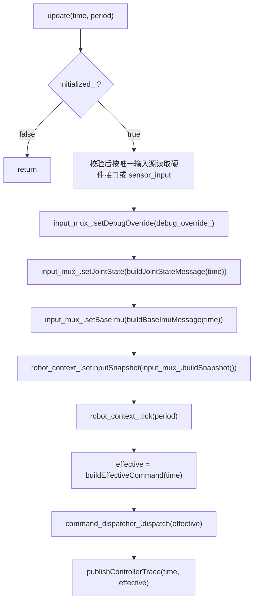

关键含义：

- `robot_context_.tick(period)` 负责外层 SMC 状态机 `RobotFSM`，以实际控制周期累计外层超时。
- `use_auto_state` 与 `use_sensor_input` 必须恰有一个为 `true`；否则 controller 初始化失败，不会在运行时混用或保留旧输入。
- `buildEffectiveCommand()` 负责在 `RobotContext` 基础命令之上叠加障碍物翻越逻辑。
- `command_dispatcher_.dispatch(effective)` 是最终写入关节和轮子的动作出口。
- `publishControllerTrace()` 在 dispatch 后采集 `RobotContextTraceState` 和 `ControllerTraceState`，
  由 `ControllerTraceBuilder` 统一组装最终 trace。

## 2. RobotFSM 外层状态机

外层状态由 `RobotFSM.sm` 定义，当前状态可通过 trace 的 `current_state` 查看。

为了避免单张图过密，外层 `RobotFSM` 拆成三张图。图中只保留短标签，详细函数、条件和变量变化在图后文字说明。

正常启动和运行主线：

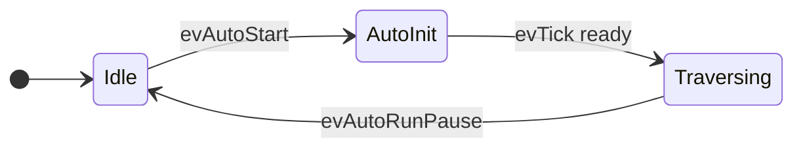

`Traversing` 中 `evTick` 对基础命令的选择：

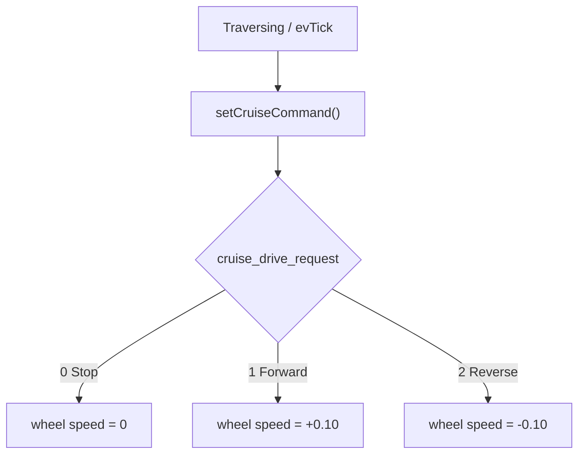

Forward/Reverse 只表示发送给左右轮的轮速数值正负，不表示机器人机械坐标系方向。
活动越障阶段会在最终命令仲裁中覆盖基础巡航命令并强制停轮。

通信、安全故障和恢复路径：

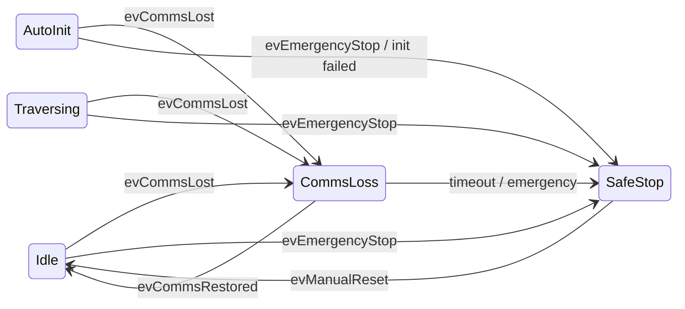

`tick(period)` 的调度优先级：

1. `input_.emergency_stop || hasSafetyFault()`：触发 `evEmergencyStop()`，清 `auto_start_requested_`。
2. 当前 `CommsLoss`：若 `input_.lower_alive` 则 `evCommsRestored()`；否则累计实际周期达到 5 秒后 `evReconnectTimeout()`。
3. 当前 `AutoInit`：若 `isReadyToTraverse()` 则 `evTick()` 进入 `Traversing`；否则累计实际周期达到 2 秒后 `evInitFailed()`。
4. 非 `CommsLoss` 且 `!input_.lower_alive`：触发 `evCommsLost()`。
5. 当前 `SafeStop`：若 `manual_reset_requested` 则 `evManualReset()`。
6. 当前 `Idle && auto_start_requested_`：触发 `evAutoStart()`。
7. 当前 `Traversing && input_.auto_run_pause`：触发 `evAutoRunPause()`。
8. 其他情况：触发 `evTick()`。

## 3. 最终命令仲裁

`buildEffectiveCommand()` 是最终命令叠加入口。

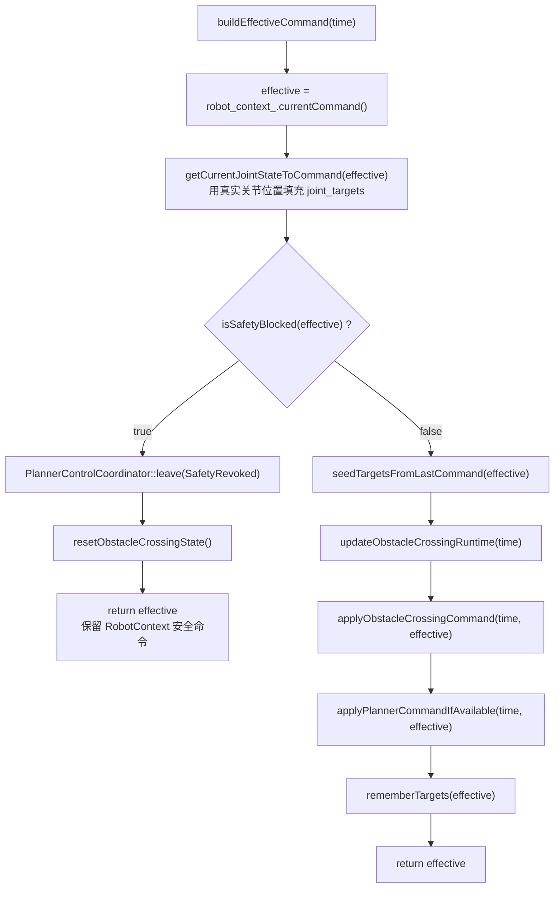

安全阻断条件：

- `robot_context_.isSafeStop()`
- `robot_context_.isCommsLoss()`
- `effective.freeze_joints == true`

安全阻断触发后修改变量：

- `crossing_runtime_` 重置为 `Idle`、`None` 侧别、空失败操作和零 retry。
- `disconnect_cable_process_` 重置为 `Idle`，同时清除 Step7 参考位置和插值段。
- `has_last_effective_joint_targets_ = false`
- 正式 Planner 会话撤权，后续命令不再覆盖 effective target

## 4. 障碍物翻越主 FSM

内部运行时对象：

- `crossing_runtime_`：主阶段、当前/首侧、失败操作、retry、夹爪确认门控和重力补偿锁存。
- `disconnect_cable_process_`：脱缆步骤、步骤进入时间、转换原因、插值段和 Step7 结果。
- `CrossingSideProfile`：夹爪、对侧执行腿关节、重力补偿模式及统一的 `motion_sign`。

为了提高可读性，主 FSM 拆成“正常路径”“失败进入人工干预”“人工干预恢复映射”三张图。图中使用短状态名，完整状态名、函数名和变量变化在后续小节展开。

正常翻越路径：

```mermaid
flowchart LR
  I["Idle"] --> FO["FirstSide OpenGripper"]
  FO --> FG["FirstSide EnableGravityCompensation"]
  FG --> FD["FirstSide Disconnecting"]
  FD --> FW["FirstSide DisconnectDoneWaitFlip"]
  FW -- start_flip --> FP["FirstSide PlannerControl"]
  FP --> FC["FirstSide RemoteControl"]
  FC --> FR["FirstSide Regrip"]
  FR --> SO["SecondSide OpenGripper"]
  SO --> SG["SecondSide EnableGravityCompensation"]
  SG --> SD["SecondSide Disconnecting"]
  SD --> SP["SecondSide PlannerControl"]
  SP --> SC["SecondSide RemoteControl"]
  SC --> SR["SecondSide Regrip"]
  SR --> W["CompleteWaitObstacleClear"]
  W --> I
```

自动失败和 retry 路径：

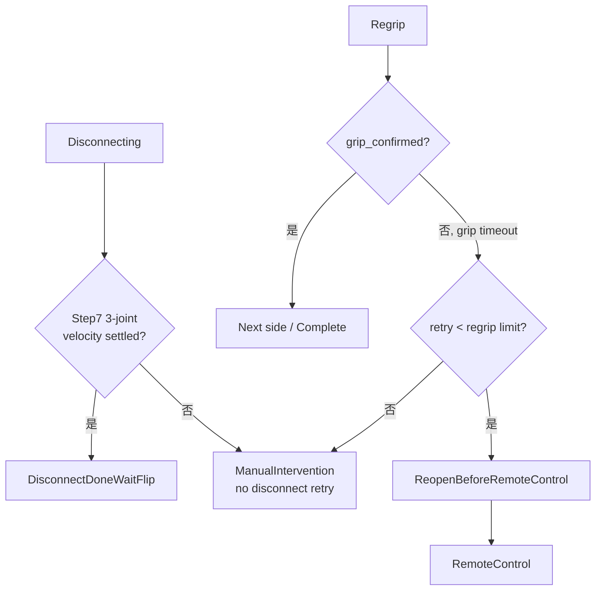

人工干预恢复映射：

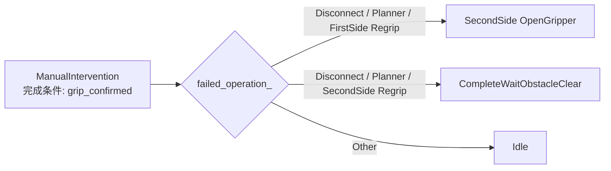

### 4.1 Idle

进入条件：

- 初始化默认状态。
- `CompleteWaitObstacleClear` 中收到新的越障触发下降沿后调用 `resetObstacleCrossingState()`。
- 安全阻断时调用 `resetObstacleCrossingState()`。

转出条件：

- `robot_context_.isTraversing() == true`
- 当前控制器运行期间收到新的 `obstacle_crossing_trigger: 0 -> 1` 上升沿

转出动作：

- `crossing_runtime_` 清零 retry 和失败操作，并根据上次完整越障成功后累计的双轮平均有符号净角行程记录首侧。
- 阶段直接转入 `OpenGripperBeforeGravityCompensation`，不再先执行双夹爪闭合重试。

首侧选择：

- `signed_wheel_travel < 0.0`：`first_crossing_side_ = Right`
- `signed_wheel_travel >= 0.0`：`first_crossing_side_ = Left`

`signed_wheel_travel` 由左右驱动轮实际位置反馈相对当前基准的变化量取平均得到，单位为 rad。
控制器启动和每次进入 `CompleteWaitObstacleClear` 时重新建立基准；SafeStop、CommsLoss 与普通暂停不重置。

命令行为：

- 若外层处于 `Traversing`，两个夹爪目标置为 `HALFOPEN`。

### 4.2 CloseBothGrippers（保留类型，当前自动入口不使用）

目的：

- 该阶段仅作为兼容状态保留；当前 `start_disconnect` 和越障触发都直接进入首侧张开阶段。

命令行为：

- `stopWheels(effective, "crossing_close_grippers")`
- `LeftGripper = CLOSED`
- `RightGripper = CLOSED`
- `drive_mode = Stop`
- `left_wheel_speed = 0.0`
- `right_wheel_speed = 0.0`
- `stop_all = true`
- `freeze_joints = false`

成功转出：

- 条件：本阶段内先观察到 `grip_confirmed=false`，随后观察到新的 `false -> true`。
- 动作：
  - `retry_counts_.close_grippers = 0`
  - `enterOpenGripperBeforeGravityCompensation(first_crossing_side_)`

进入阶段前残留的 `grip_confirmed=true` 不会被当作本次双夹爪闭合完成。

超时直接进入人工干预，不自动重试。

### 4.3 OpenGripperBeforeGravityCompensation

目的：

- 首侧确定后，先张开当前越障侧夹爪，并在重力补偿关闭状态下等待夹爪完成动作。

命令行为：

- 轮子保持停止。
- 当前越障侧夹爪目标为 `OPEN`，另一侧夹爪保持 `CLOSED`。
- 重力补偿模式保持 `Off`。
- 等待 `obstacle_crossing/wait_for_grip_respond_time` 后进入 `EnableGravityCompensation`。

当前协议没有单侧“完全张开”确认位，因此这里采用配置等待时间，不使用只能表示“双侧是否均闭合”的 `grip_confirmed=false` 作为张开完成条件。

### 4.4 EnableGravityCompensation

目的：

- 当前越障侧夹爪完成张开等待后，开启对应的重力补偿。

命令行为：

- 轮子保持停止。
- 当前越障侧夹爪保持 `OPEN`，另一侧夹爪保持 `CLOSED`。
- 按 `crossing_side_` 开启其对侧第一腿部关节重力补偿。
- 在该阶段的一个控制周期内下发重力补偿命令；下一控制周期调用 `enterDisconnecting(crossing_side_)`。

该阶段同样用于第一侧回夹完成后切换到第二侧，以及双夹爪闭合人工确认后的恢复路径。

当前通信协议没有“重力补偿已生效”反馈，因此这里保证的是控制帧发送顺序和最小等待时间，不能证明下位机或电机侧已经完成物理响应。

### 4.5 Disconnecting

目的：

- 对当前 `crossing_side_` 执行脱缆流程。

命令行为：

- `stopWheels(effective, "disconnect_<side>_active")`
- 调用 `applyDisconnectCableCommand(time, effective)`
- 当前侧夹爪目标设为 `OPEN`
- 正常进入时从 `Step3UpFirstJoint` 开始；张开命令和响应等待已由前置阶段完成。
- 锁定臂 second joint 全程保持原目标，不参与脱缆动作。

成功转出：

- 条件：锁定臂 first joint 抬升/回落完成，且 Step7 三个位姿关节低速稳定门控成功。
- 动作：复位脱缆子流程并进入 `DisconnectDoneWaitFlip`，不启动 PlannerControl。

### 4.6 DisconnectDoneWaitFlip

目的：

- 将脱缆和 MoveIt 翻越拆开验证。
- 保持当前侧夹爪打开、轮子停止、最后关节目标和当前侧重力补偿。
- 不创建 PlannerControl session，因此不受 Planner 总看门狗影响。

`start_flip`（`std_msgs/Empty`）只在该状态接受，接受后进入 `PlannerControl` 并创建正式会话。
独立测试命令 `rosrun gp11 gp11_single_flip.py` 会完成状态检查、触发 `start_flip`，随后向
MoveIt Cartesian Action 发送老工程已验证的左锚 180 度目标点。规划通过审计后直接发布轨迹，
不需要人工传递 plan_id。

### 4.7 PlannerControl

目的：

- 脱缆成功后，让 Planner 在当前会话内接管四个腿部关节目标，直到正式完成握手或安全撤权。

进入函数：

- `enterPlannerControl(time, side)`

进入时修改变量：

- `crossing_runtime_` 转入 `PlannerControl` 并保留当前侧。
- `disconnect_cable_process_` 复位为 `Idle`；`PlannerControlCoordinator` 进入当前侧的 PlannerControl。
- `normal` 模式下 Coordinator 启动内部 `PlannerSession`，递增 `session_id`，并用进入瞬间的四关节反馈作为首点 delta 参考；`debug` 模式只清空旧 release。

命令行为：

- 先 `stopWheels(effective, "planner_<side>_wait")`
- 再由 `applyPlannerCommandIfAvailable()` 从 Coordinator 获取 fresh 的 Planner 点并覆盖四个腿部关节。

Planner 覆盖条件：

- `obstacle_crossing_stage_ == PlannerControl`
- 生产模式：`PlannerControlCoordinator::commandCandidate(time)` 返回有效点。
- 调试模式不接收关节点，只验证 PlannerControl 等待和手动放行。

Planner 覆盖关节：

- `LeftFirstLeg = point.left_first`
- `LeftSecondLeg = point.left_second`
- `RightFirstLeg = point.right_first`
- `RightSecondLeg = point.right_second`

不覆盖内容：

- 不覆盖夹爪。
- 不覆盖轮子。
- 不在非 `PlannerControl` 阶段接管。

`normal` 模式正常转出条件：

- `CompletePlannerControl(session_id, final_sequence)` 已由 Coordinator 校验并排队。
- Coordinator 在控制周期中消费该请求，且 `final_sequence` 仍为最后接受序号。

转出动作：

- Coordinator 结束内部 Session，记录 `EXIT_COMPLETED`
- `enterRemoteControl(time, crossing_side_)`

`normal` 模式异常转出：

- `planner_interface/total_watchdog_timeout` 到期后，Coordinator 记录 `EXIT_TOTAL_WATCHDOG_TIMEOUT`。
- `failed_operation_ = PlannerControl`，进入 `ManualIntervention`，不假定规划成功。

`debug` 模式由 `roslaunch b29_control start.launch planner_mode:=debug` 统一启用；Coordinator 在该固定模式下持续等待 `planner_release`。不再提供固定时间自动放行分支；收到有效服务请求后进入 `RemoteControl`。
### 4.8 RemoteControl

目的：

- Planner 完成后，由下位机遥控器通过 `RemoteControlInterface` 对四个腿部关节做增量微调。
- 每个新样本先进行死区过滤，再乘以灵敏度系数，最后执行单帧增量限幅并累加到关节目标。
- 对应参数为 `remote_control/increment_deadband`、`remote_control/increment_scale` 和
  `remote_control/max_increment_per_sample`。
- 四关节方向由 `remote_control/joint_direction_signs` 配置；当前映射为
  `[left_first, left_second, right_first, right_second] = [-1, +1, +1, +1]`。

命令行为：

- 进入时以当前四关节反馈为累计起点。
- 每个新反馈样本只累加一次，单关节增量截断到 `[-0.10, +0.10] rad`。
- 停止驱动轮，当前侧夹爪保持 `OPEN`，继续使用当前侧重力补偿策略。
- 只有进入阶段后新的完成信号 `0 -> 1` 上升沿才进入 `Regrip`。

### 4.9 Regrip

目的：
- RemoteControl 收到有效完成上升沿后，当前侧重新夹紧线缆。

命令行为：

- `stopWheels(effective, "regrip_<side>_wait")`
- `current side gripper = CLOSED`

首侧成功：

- 条件：当前 `Regrip` 阶段内观察到新的 `grip_confirmed: false -> true`，且 `crossing_side_ == first_crossing_side_`
- 动作：
  - 清零当前侧 regrip retry
  - `enterOpenGripperBeforeGravityCompensation(oppositeCrossingSide(crossing_side_))`

第二侧成功：

- 条件：`isGripConfirmed() == true && crossing_side_ != first_crossing_side_`
- 动作：
  - 清零当前侧 regrip retry
  - `crossing_runtime_` 转入 `CompleteWaitObstacleClear` 并将当前侧置为 `None`。

失败重试：

- 条件：等待超过 `crossing_config_.wait_for_grip_respond_time` 且当前侧 regrip retry 小于 `crossing_config_.retry_limit`。
- 动作：
  - `++retry_counts_.regrip[0]` 或 `++retry_counts_.regrip[1]`
  - `obstacle_crossing_stage_ = ReopenBeforeRemoteControl`
  - `gripper_wait_start_time_ = time`

进入人工干预：

- 条件：当前侧 regrip retry 达到 `crossing_config_.retry_limit`
- 函数：`enterManualIntervention(Regrip, crossing_side_)`
### 4.10 ReopenBeforeRemoteControl

目的：

- Regrip 失败但未达到人工介入阈值时，先重新张开当前侧夹爪，再回到当前侧 `RemoteControl`。

命令行为：

- `stopWheels(effective, "regrip_<side>_reopen_before_remote_control")`
- `current side gripper = OPEN`

转出：

- 条件：等待超过 `crossing_config_.wait_for_grip_respond_time`
- 函数：`enterRemoteControl(time, crossing_side_, "regrip_retry_reopen_completed")`

### 4.11 CompleteWaitObstacleClear

目的：

- 左右两侧均完成脱缆、Planner 接管和回夹后，恢复巡航基础命令，但等待下位机撤销越障触发信号，防止同一次触发重复启动。
- 进入该阶段时立即关闭重力补偿，并重新建立双轮行程基准。

命令行为：

- 保留 `RobotContext::setCruiseCommand()` 根据 `cruise_drive_request` 生成的轮速
- `0=Stop`、`1=Forward(+0.10)`、`2=Reverse(-0.10)`
- `freeze_joints = false`
- `LeftGripper = HALFOPEN`
- `RightGripper = HALFOPEN`
- `command_reason = "crossing_complete_wait_obstacle_clear"`

转出条件：

- 已经进入本阶段后，收到新的 `obstacle_crossing_trigger: 1 -> 0` 下降沿
- 越障期间提前出现的下降沿会被丢弃；下位机必须重新产生一个有效下降沿

转出动作：

- `resetObstacleCrossingState()`，转换原因记录为 `obstacle_trigger_falling_edge`

### 4.12 ManualIntervention

目的：

- 自动动作失败达到 retry 上限后，停止轮子，停止 Planner/脱缆覆盖，等待人工处理。

进入函数：

- `enterManualIntervention(operation, side)`

进入时修改变量：

- `crossing_runtime_` 记录失败操作和当前侧，并转入 `ManualIntervention`。
- `disconnect_cable_process_` 与遥控会话被复位；正式 Planner 会话被撤权。

命令行为：

- `stopWheels(effective, "manual_intervention_<failed_action>")`
- 由于 `seedTargetsFromLastCommand()` 排除了 `ManualIntervention`，且每周期先调用 `getCurrentJointStateToCommand()`，人工干预期间关节目标默认跟随真实反馈位置。

完成条件：

- `robot_context_.isGripConfirmed() == true`
- 人工确认表示当前侧已由人工完成并重新夹紧；除双夹爪闭合失败外，不再回到当前侧的脱缆、Planner 或遥控阶段。

退出前清理：

- `crossing_runtime_` 只清除导致人工介入的 retry，并按恢复映射进入下一侧或完成等待。

失败动作到下一阶段的映射：

| failed_operation_ | crossing_side_ | 人工确认后进入 | 触发函数 / 变量变化 |
|---|---|---|---|
| `CloseBothGrippers` | `first_crossing_side_` | `FirstSide OpenGripperBeforeGravityCompensation` | `enterOpenGripperBeforeGravityCompensation(first_crossing_side_)` |
| `DisconnectCable` / `PlannerControl` / `Regrip` | `first_crossing_side_` | `SecondSide OpenGripperBeforeGravityCompensation` | 当前侧视为已人工完成并回夹；`clearGravityCompensationLatch()`，再调用 `enterOpenGripperBeforeGravityCompensation(oppositeCrossingSide(crossing_side_))` |
| `DisconnectCable` / `PlannerControl` / `Regrip` | 第二侧 | `CompleteWaitObstacleClear` | 当前侧视为已人工完成并回夹；调用 `enterCompleteWaitObstacleClear(time, "manual_intervention_current_side_completed")` |
| 其他 | 任意 | `Idle` | `resetObstacleCrossingState()` |

## 5. 脱缆子流程

脱缆步骤由 `disconnect_cable_process_` 管理。该执行器独占步骤、步骤进入时间、转换原因、插值段和 Step7 成功结果；控制器只提供当前命令目标和关节反馈，再将执行结果写回 effective command。

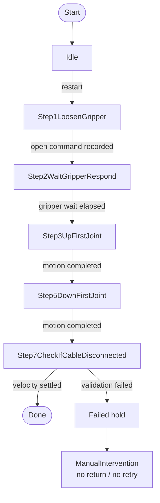

脱缆步骤命令细节：

| Step | command_reason | 动作 | 关键变量 |
|---|---|---|---|
| `Step1LoosenGripper` | `disconnect_<side>_step1_loosen_gripper` | 当前侧夹爪 `OPEN` | `DisconnectCableProcess::update()` 将 step 转入 `Step2WaitGripperRespond` |
| `Step2WaitGripperRespond` | `disconnect_<side>_step2_wait_gripper` | 等待夹爪响应 | 超过 `crossing_config_.wait_for_grip_respond_time` 后 step -> `Step3UpFirstJoint` |
| `Step3UpFirstJoint` | `disconnect_<side>_step3_up_first_joint` | 第一关节插值到 `obstacle_crossing/disconnect_cable_first_joint_up_position` | `applyMotionSegment()` |
| `Step5DownFirstJoint` | `disconnect_<side>_step5_down_first_joint` | 第一关节插值到 `obstacle_crossing/disconnect_cable_first_joint_down_position` | `applyMotionSegment()` |
| `Step7CheckIfCableDisconnected` | `disconnect_<side>_step7_check_disconnect` | 检测脱缆后的稳定状态 | 只要求三个位姿关节最大绝对速度连续 `disconnect_settle_duration` 不超过 `disconnect_settle_velocity_threshold`。不检查固定关节角度，自由臂 second joint 不参与速度门控。 |
| `Failed` | `disconnect_<side>_failed` | 使用当前关节反馈保持 | 上层立即进入 `ManualIntervention`，不重试 |

当前侧与实际动作关节映射：

| crossing_side_ | `jointsForCrossingSide().gripper` | `jointsForCrossingSide().actuator_first_leg` | `jointsForCrossingSide().actuator_second_leg` |
|---|---|---|---|
| `Left` | `LeftGripper` | `RightFirstLeg` | `RightSecondLeg` |
| `Right` | `RightGripper` | `LeftFirstLeg` | `LeftSecondLeg` |

注意：当前实现是对“当前检查侧”打开夹爪，但脱缆动作关节使用对侧腿部关节。

异常兜底：

- 正常流程不会以 `CrossingSide::None` 调用侧名或关节映射函数。
- 当前 `sideReasonName(None)` 返回 `"none"`。
- `jointsForCrossingSide(None, ...)` 返回 `false`，调用点会停止轮子并冻结关节目标。
- 因此 `None` 不会静默落入任意一侧关节映射。

## 6. 动作平滑机制

`Step3`、`Step5` 由 `DisconnectCableProcess::applyMotionSegment()` 平滑插值。
每个动作以进入该 step 时的 effective target 作为起点；first joint 抬升/回落目标由
`CrossingSideProfile::motion_sign` 统一乘以侧别符号，避免在 controller 中分别维护左右方向分支。

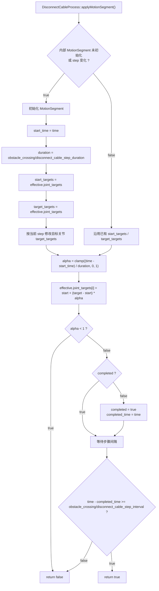

平滑程度由以下配置参数控制：

- `obstacle_crossing/disconnect_cable_step_duration`：插值运动时间，越大越慢越平滑。
- `obstacle_crossing/disconnect_cable_step_interval`：插值到目标后停留多久才进入下一步。

## 7. Planner 输入接收与应用

### 7.1 生产接口

`plannerJointCommandCallback()` 接收 `PlannerJointCommand`，顺序固定为
`[left_first, left_second, right_first, right_second]`。`PlannerSession` 统一校验：

- 当前会话必须 `active && accepting_commands`，且 `session_id` 匹配。
- 首个序号必须为 1，后续严格递增，不允许跳号。
- 同序号同内容允许重发；同序号不同内容拒绝。
- `header.stamp` 必须在 `command_timeout` 内，四个位置必须 finite。
- 首点相对进入 PlannerControl 时的实时姿态、后续点相对上一接受点均不得超过 `max_delta_per_command`。

合法命令先进入单槽 pending，不会在 callback 中立即推进确认序号。控制周期将该点应用为 effective command，且 `CommandDispatcher` 在 `normal` 输出模式、非冻结状态下成功写入关节句柄后，才推进 `PlannerControlState.last_accepted_sequence` 并在同一 update 周期发布 ACK。pending 未确认前只允许同序号同内容重发，下一序号不能覆盖它。命令超过 `command_timeout` 后不再作为新鲜覆盖，但 SMC 保持上一 effective target。

### 7.2 调试接口

旧四元素 `planner_joint_point` 输入已删除。`start.launch` 的 `planner_mode:=debug` 只保留
`planner_release` 手动放行，用于验证 PlannerControl 阶段转换，不覆盖四个腿部关节。

## 8. Trace 输出

`publishControllerTrace()` 在 `CommandDispatcher::dispatch()` 后执行，输出顺序：

1. `robot_context_.traceState()` 采集 RobotFSM、基础命令和最近事件。
2. `captureControllerTraceState(stamp)` 采集越障、脱缆、Planner、RemoteControl、retry、输入与 dispatch 状态。
3. `ControllerTraceBuilder::build(stamp, effective_command, robot_state, controller_state)` 统一组装 `AutoStateTrace`。

`ControllerTraceBuilder` 只读取快照，不访问硬件句柄、不修改 FSM，也不参与命令仲裁。

controller 追加的 trace 字段：

| trace 字段 | 来源变量 / 函数 |
|---|---|
| `obstacle_crossing_active` | `obstacle_crossing_stage_ != Idle` |
| `obstacle_crossing_stage` | `ControllerTraceState::obstacle_crossing_stage`，由 builder 转换为字符串 |
| `obstacle_crossing_side` | `ControllerTraceState::crossing_side`，由 builder 转换为字符串 |
| `disconnect_step` | `ControllerTraceState::disconnect_step`，由 builder 转换为字符串 |
| `manual_intervention_active` | `obstacle_crossing_stage_ == ManualIntervention` |
| `manual_intervention_reason` | builder 根据 `failed_operation` 生成，仅人工干预中有效 |
| `failed_action` | builder 根据 `failed_operation` 生成 |
| `retry_count` | `captureControllerTraceState()` 根据当前失败操作和侧别采集 |

最终命令 trace 由 `ControllerTraceBuilder` 根据 effective command 写入：

- `command_reason`
- `stop_all`
- `freeze_joints`
- `left_wheel_speed`
- `right_wheel_speed`
- `crossing_strategy`

## 9. Retry 计数

| 动作 | 计数变量 | 上限 | 成功清零位置 |
|---|---|---|---|
| 双夹爪闭合 | `retry_counts_.close_grippers` | 不自动重试 | 兼容状态，不作为当前自动入口 |
| 左脱缆 | `retry_counts_.disconnect[0]` | 不自动重试 | 失败直接人工介入 |
| 右脱缆 | `retry_counts_.disconnect[1]` | 不自动重试 | 失败直接人工介入 |
| 左回夹 | `retry_counts_.regrip[0]` | `obstacle_crossing/retry_limit` | `Regrip` 中左侧 `isGripConfirmed()` 成功 |
| 右回夹 | `retry_counts_.regrip[1]` | `obstacle_crossing/retry_limit` | `Regrip` 中右侧 `isGripConfirmed()` 成功 |

额外清零场景：

- 新障碍流程触发时：`resetRetryCounts()`。
- 安全阻断时：`resetObstacleCrossingState()` 内部调用 `resetRetryCounts()`。
- 人工干预退出时：`clearRetryForOperation(operation, side)` 只清导致人工干预的动作对应 retry。

## 10. 关键状态变量总表

| 变量 | 类型 | 作用 |
|---|---|---|
| `obstacle_crossing_stage_` | `ObstacleCrossingStage` | 障碍翻越主状态 |
| `crossing_side_` | `CrossingSide` | 当前处理侧：`Left` / `Right` / `None` |
| `first_crossing_side_` | `CrossingSide` | 本次越障首侧，由双轮实际位置反馈的有符号净行程确定，并决定 FirstSide / SecondSide 顺序 |
| `failed_operation_` | `FailedOperation` | 进入人工干预的失败动作 |
| `crossing_runtime_` | `ObstacleCrossingRuntime` | 主阶段、侧别、retry、人工恢复、夹爪确认门控和重力补偿锁存 |
| `disconnect_cable_process_` | `DisconnectCableProcess` | 脱缆步骤、步骤计时、插值和 Step7 稳定结果 |
| `CrossingSideProfile` | `CrossingSideProfile` | 当前夹爪、对侧两关节、重力补偿模式和 `motion_sign` |
| `last_effective_joint_targets_` | `array<double, 6>` | 非人工干预阶段保持上一帧目标，避免每帧从反馈重置动作起点 |
| `has_last_effective_joint_targets_` | `bool` | 上一帧目标是否有效 |
| `planner_control_coordinator_` | `PlannerControlCoordinator` | 固定模式、阶段进入/退出、完成/超时、调试 release、候选点和 dispatcher 后 ACK |
| `PlannerSession` | `PlannerControlCoordinator` 私有成员 | 正式会话 ID、严格序号、接受/拒绝记录、最新命令、完成请求和退出原因 |

### 10.1 参数来源与加载

`loadParameters()` 从 controller namespace 读取：

- `posture_roll_limit` -> `input_mux_config_.max_abs_roll_rad`
- `posture_pitch_limit` -> `input_mux_config_.max_abs_pitch_rad`
- `obstacle_crossing/...` -> `crossing_config_` 和 `disconnect_config_`

姿态阈值校验通过后，通过 `input_mux_ = AutoInputMux(input_mux_config_)` 应用到输入检查逻辑。

越障运动与安全参数的唯一配置来源是 `b29_control/config/controller.yaml`；Planner 模式的唯一入口是
`start.launch` 的 `planner_mode` 参数，launch 会覆盖 `planner_interface/mode` 和
`debug_validation/enabled`。`PlannerControlCoordinator` 由模式推导是否允许手动放行，不再读取独立的 `planner_control/manual_release_enabled`。
`start.launch` 是 B29 当前唯一启动入口；Gazebo 专用 launch 已移除。

`obstacle_crossing.yaml` 和 `start_smc_in_gazebo.launch` 已删除，不存在额外的
越障参数覆盖层。修改 `obstacle_crossing/...`、`remote_control/...`、
`planner_interface/...` 后，需要重启对应控制器使参数生效。

## 11. 命令原因字符串

当前障碍流程中可能写入的 `command_reason`：

- `crossing_close_grippers`
- `disconnect_left_active`
- `disconnect_right_active`
- `disconnect_left_step1_loosen_gripper`
- `disconnect_right_step1_loosen_gripper`
- `disconnect_left_step2_wait_gripper`
- `disconnect_right_step2_wait_gripper`
- `disconnect_left_step3_up_first_joint`
- `disconnect_right_step3_up_first_joint`
- `disconnect_left_step5_down_first_joint`
- `disconnect_right_step5_down_first_joint`
- `disconnect_left_step7_check_disconnect`
- `disconnect_right_step7_check_disconnect`
- `planner_left_wait`
- `planner_right_wait`
- `planner_left_control`
- `planner_right_control`
- `regrip_left_wait`
- `regrip_right_wait`
- `manual_intervention_close_both_grippers`
- `manual_intervention_disconnect_cable`
- `manual_intervention_planner_regrip`
- `crossing_complete_wait_obstacle_clear`

## 12. 一次完整成功路径

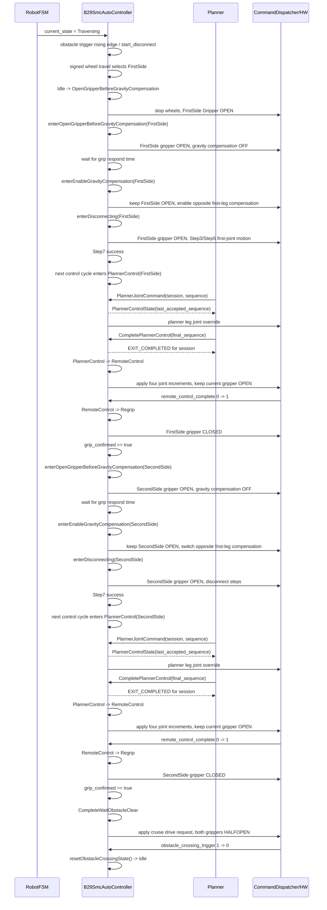

## 13. 安全中断路径

任何周期只要 `buildEffectiveCommand()` 看到安全阻断条件为真，障碍翻越内部流程立即清空。

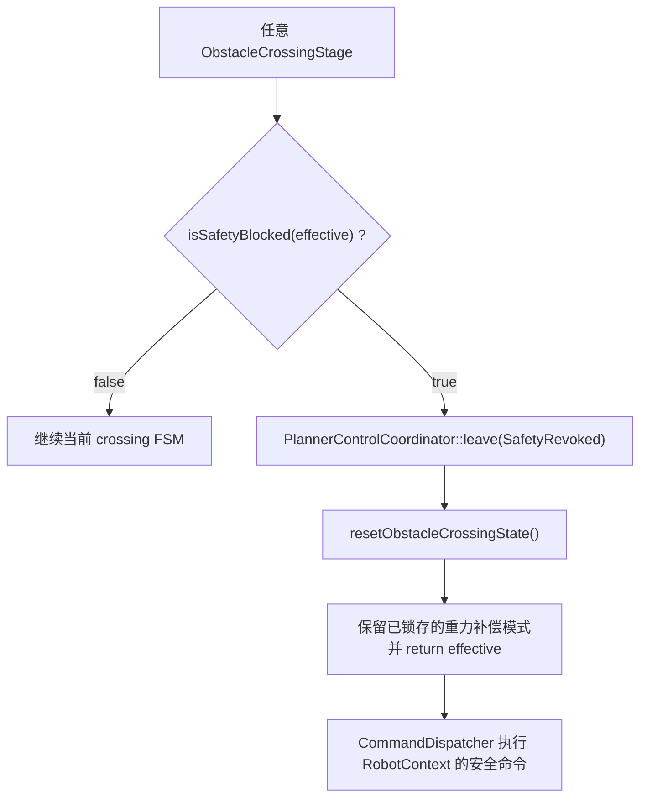

安全阻断来源：

- 外层 `RobotFSM` 进入 `SafeStop`。
- 外层 `RobotFSM` 进入 `CommsLoss`。
- `RobotContext` 命令中 `freeze_joints == true`。

这里不会继续执行 Planner 接管、脱缆插值或人工干预恢复映射。若安全中断前当前侧已经进入重力补偿阶段，补偿模式会保持锁存；只有越障完成回夹，或安全复位时 `grip_confirmed=true`，才会关闭该锁存。

## 14. 调试验证模式

正式流程默认关闭调试覆盖：

```bash
# 正式 Planner 会话
roslaunch b29_control start.launch planner_mode:=normal

# PlannerControl 手动放行调试
roslaunch b29_control start.launch planner_mode:=debug
```

`planner_mode` 是 SMC 与 Adapter 的唯一模式入口：`normal` 会关闭调试门禁，`debug` 会启用调试门禁和 Coordinator 的手动放行路径。运行中不支持切换模式，也不再存在独立的 `planner_control/manual_release_enabled` 参数。`debug_validation/enabled=false` 时，controller 收到 `debug_override` 会忽略，不会污染正式输入。

PlannerControl 正式与调试退出方式互斥：

- `normal` 模式：adapter 完成最终反馈稳定判定后调用 `complete_planner_control`，控制周期确认后进入 `RemoteControl`；总看门狗到期进入 `ManualIntervention`。
- `debug` 模式：由 `planner_mode:=debug` 选择手动放行路径，持续等待 `planner_release` 后进入 `RemoteControl`。

新增服务：

```text
/b29_controller/b29_smc_auto_controller/planner_release
/b29_controller/b29_smc_auto_controller/complete_planner_control
/b29_controller/b29_smc_auto_controller/software_emergency_stop
/b29_controller/b29_smc_auto_controller/manual_reset
```

新增 trace 包含：

- 主 FSM 和脱缆 Step 的进入时间、持续时间、转换原因
- Step7 三关节最大速度、速度阈值和稳定持续时间
- 五组 retry 计数和三组上限
- Planner 点 available/fresh、是否实际覆盖 effective targets
- RemoteControl 原始/截断增量、累计目标、样本序号和完成上升沿
- 六关节 effective targets、夹爪目标、dispatch 尝试结果
- 调试门禁、软件急停锁存和 RobotContext 输入快照

完整操作命令见：

```text
b29_control/docs/b29_smc_obstacle_crossing_debug_validation.md
```
