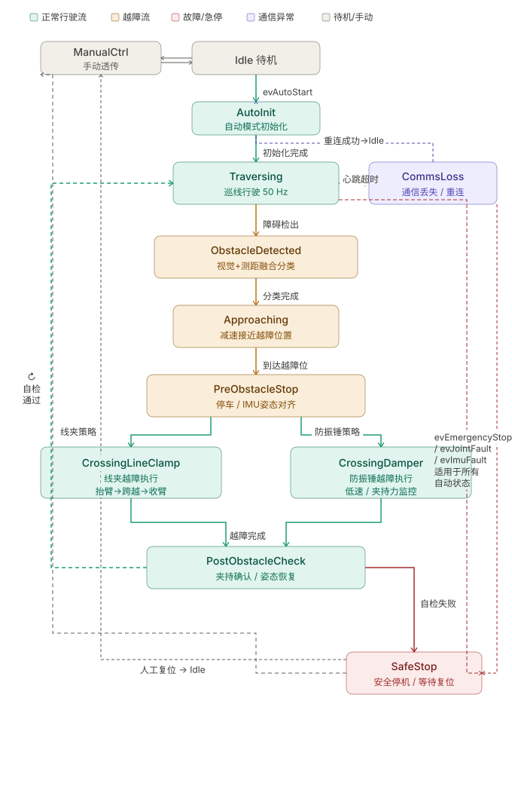
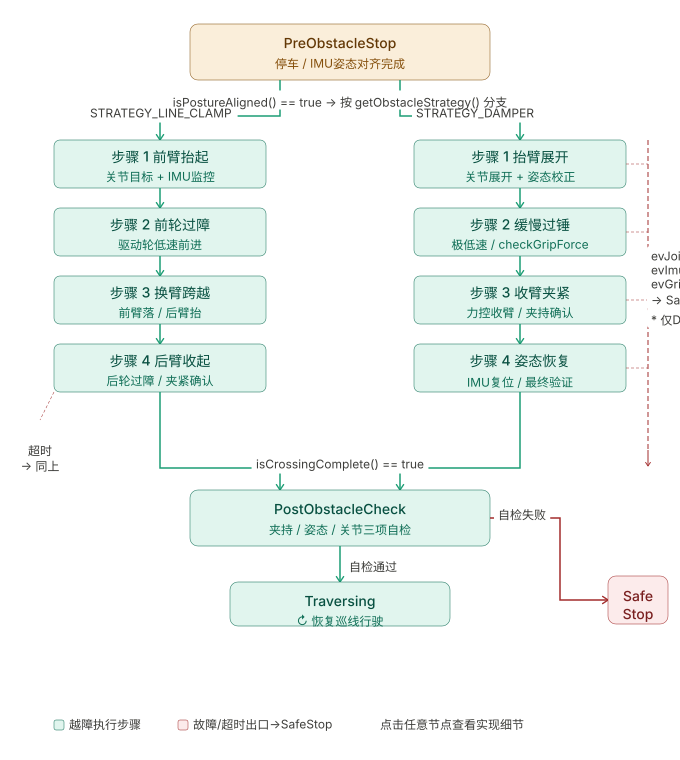

# 越障机器人状态机 — 完整事件与转移表


越障逻辑




## 事件列表（Events）

| 事件名 | 来源 | 说明 |
|---|---|---|
| `evTick` | 50Hz定时器 | 主周期驱动事件，所有需要周期检查的逻辑均由此触发 |
| `evAutoStart` | 下位机/操作员 | 下发自动运行指令 |
| `evAutoRunPause` | 下位机 | 下位机主动请求暂停自动运行 |
| `evManualEnable` | 操作员 | 切换为手动控制模式 |
| `evManualDisable` | 操作员 | 退出手动控制模式 |
| `evManualReset` | 操作员 | 人工复位（仅SAFE_STOP中有效）|
| `evEmergencyStop` | 操作员/硬件 | 紧急停止，任意自动状态均响应 |
| `evCommsLost` | 通信层 | 下位机心跳超时（推荐阈值：3个周期=60ms）|
| `evCommsRestored` | 通信层 | 下位机重连成功 |
| `evReconnectTimeout` | 定时器 | 重连等待超时（推荐：5s）|
| `evInitDone` | 初始化模块 | 自动初始化序列完成 |
| `evInitFailed` | 初始化模块 | 自动初始化失败 |
| `evClassifyTimeout` | 定时器 | 障碍分类超时（推荐：2s=100 ticks）|
| `evApproachTimeout` | 定时器 | 接近定位超时（推荐：10s）|
| `evAlignTimeout` | 定时器 | 姿态对齐超时（推荐：3s）|
| `evCrossingTimeout` | 定时器 | 越障执行超时（推荐：线夹30s，防振锤60s）|
| `evPostCheckTimeout` | 定时器 | 越障后自检超时（推荐：5s）|
| `evJointFault` | 关节监控 | 关节超限或力矩异常 |
| `evImuFault` | IMU监控 | IMU数据异常或丢失 |
| `evGripFault` | 夹持力监控 | 夹持力不足（防振锤越障专用）|

---

## 状态转移矩阵

| 当前状态 | 事件（+Guard） | 目标状态 | 关键动作 |
|---|---|---|---|
| Idle | evAutoStart [lower alive & IMU ready] | AutoInit | initAutoMode |
| Idle | evManualEnable | ManualCtrl | enableManualPassthrough |
| Idle | evCommsLost | CommsLoss | stopAllMotors |
| ManualCtrl | evManualDisable | Idle | disableManualPassthrough |
| ManualCtrl | evEmergencyStop | SafeStop | stopAllMotors |
| ManualCtrl | evCommsLost | CommsLoss | stopAllMotors |
| AutoInit | evInitDone [posture ready & grip OK] | Traversing | setDriveMode FORWARD |
| AutoInit | evInitFailed | SafeStop | reportError |
| AutoInit | evCommsLost / evEmergencyStop | CommsLoss / SafeStop | stopAllMotors |
| Traversing | evTick [obstacle detected] | ObstacleDetected | setTargetSpeed(0) |
| Traversing | evTick [no obstacle] | nil (self) | updateLineTracking, sendDrive |
| Traversing | evAutoRunPause | Idle | stopAllMotors |
| Traversing | evCommsLost / evEmergencyStop | CommsLoss / SafeStop | stopAllMotors |
| ObstacleDetected | evTick [done & LINE_CLAMP] | Approaching | setStrategy(LINE_CLAMP) |
| ObstacleDetected | evTick [done & DAMPER] | Approaching | setStrategy(DAMPER) |
| ObstacleDetected | evTick [done & UNKNOWN] | SafeStop | reportError |
| ObstacleDetected | evClassifyTimeout | SafeStop | reportError |
| Approaching | evTick [at crossing pos] | PreObstacleStop | — |
| Approaching | evTick [not at pos] | nil (self) | updateApproach, sendDrive |
| Approaching | evApproachTimeout | SafeStop | reportError |
| PreObstacleStop | evTick [aligned & LINE_CLAMP] | CrossingLineClamp | startCrossingSequence |
| PreObstacleStop | evTick [aligned & DAMPER] | CrossingDamper | startCrossingSequence |
| PreObstacleStop | evAlignTimeout | SafeStop | reportError |
| CrossingLineClamp | evTick [step done, not complete] | nil (self) | advanceStep, sendJoint, sendDrive |
| CrossingLineClamp | evTick [complete] | PostObstacleCheck | — |
| CrossingLineClamp | evJointFault / evImuFault | SafeStop | stopAll, freezeJoints, reportError |
| CrossingLineClamp | evCrossingTimeout | SafeStop | stopAll, freezeJoints, reportError |
| CrossingDamper | evTick [step done, not complete] | nil (self) | advanceStep, sendJoint, checkGrip |
| CrossingDamper | evTick [complete] | PostObstacleCheck | — |
| CrossingDamper | evJointFault / evImuFault / evGripFault | SafeStop | stopAll, freezeJoints, reportError |
| CrossingDamper | evCrossingTimeout | SafeStop | stopAll, freezeJoints, reportError |
| PostObstacleCheck | evTick [check passed] | Traversing | clearObstacleState |
| PostObstacleCheck | evTick [check failed] | SafeStop | reportError |
| PostObstacleCheck | evPostCheckTimeout | SafeStop | reportError |
| CommsLoss | evCommsRestored | Idle | alertOperator(RESTORED) |
| CommsLoss | evReconnectTimeout | SafeStop | reportError |
| SafeStop | evManualReset | Idle | resetFaultFlags |
| SafeStop | evManualEnable | ManualCtrl | resetFaultFlags, enableManual |

---

## Guard条件说明

所有Guard均为 `RobotContext` 的成员方法，返回 `bool`：

```
isLowerAlive()        下位机心跳在线（心跳包计时器未超时）
isImuReady()          IMU初始化完成，数据有效
isPostureReady()      roll/pitch 在允许范围内（建议 ±2°）
isGripConfirmed()     夹持传感器确认线路夹持有效
isObstacleDetected()  视觉检测框置信度 > 阈值 AND 测距 < 安全距离
isClassificationDone()分类器已输出稳定结果（连续N帧一致）
getObstacleType()     返回当前分类结果
getObstacleStrategy() 返回已设定策略
isAtCrossingPosition()测距离线夹/防振锤中心 < 定位容差
isPostureAligned()    IMU roll/pitch < 对齐阈值（建议 ±1°）
isCrossingStepDone()  当前子步骤关节位置误差 < 收敛阈值
isCrossingComplete()  越障子步骤序列索引 == 总步骤数
isPostCheckPassed()   夹持确认 AND 姿态正常 AND 关节在安全范围
isPostCheckFailed()   以上任一项明确失败（非超时）
```

---

## SMC编译命令

```bash
# 生成C++代码（-graph同时生成GraphViz状态图）
java -jar Smc.jar -lang c++ -graph -glevel 1 RobotFSM.sm

# 生成文件：
#   RobotFSM_sm.h    — 状态机类头文件（自动生成，勿手改）
#   RobotFSM_sm.cpp  — 状态机实现（自动生成，勿手改）
#   RobotFSM_sm.dot  — GraphViz状态图源文件

# 渲染状态图（需安装graphviz）
dot -Tpng RobotFSM_sm.dot -o RobotFSM_sm.png
```

---

## 集成到RobotContext（简要示例）

```cpp
#include "RobotFSM_sm.h"   // SMC自动生成
#include "RobotActions.h"   // 接口定义

class RobotContext : public RobotActions {
public:
    RobotContext() : _fsm(*this) {}

    // 50Hz主循环调用
    void tick() {
        checkComms();      // 心跳检测，超时则 _fsm.evCommsLost()
        checkEmergency();  // 急停检测
        _fsm.evTick();     // 驱动状态机
    }

    void onAutoStart()     { _fsm.evAutoStart(); }
    void onManualEnable()  { _fsm.evManualEnable(); }
    void onEmergencyStop() { _fsm.evEmergencyStop(); }
    void onManualReset()   { _fsm.evManualReset(); }

    // ... 实现所有 RobotActions 虚函数 ...

private:
    RobotFSMContext _fsm;
};
```
