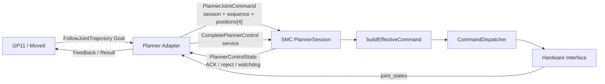
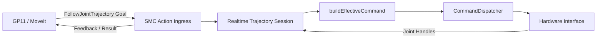
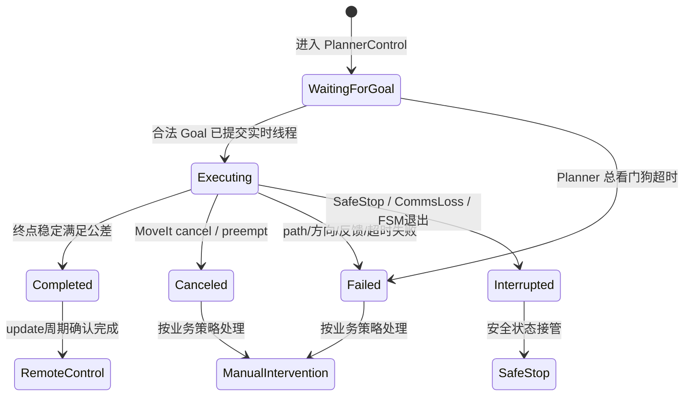

# B29 Planner Adapter 与 SMC 直接实现 FollowJointTrajectory 对比报告

## 1. 文档目的

本文用于评审 B29 的 MoveIt 轨迹执行架构，比较以下两种方案：

1. 保留当前独立 `b29_planner_adapter` 节点。
2. 删除独立 Adapter，由 `b29_smc_auto_controller` 直接实现
   `control_msgs/FollowJointTrajectoryAction`。

本文不预设最终结论。评审重点是：实时性收益是否足以覆盖安全隔离、实现复杂度和迁移风险。

## 2. 讨论边界

本文只讨论真机控制链路，不讨论 Gazebo 或其他仿真控制器。

保持不变的业务流程：

```text
Disconnecting
  -> PlannerControl
  -> RemoteControl
  -> Regrip
```

无论采用哪种方案，都必须满足：

- 只有越障 FSM 处于 `PlannerControl` 时才允许执行 MoveIt 轨迹。
- 最终关节目标仍由 `buildEffectiveCommand()` 仲裁。
- 最终输出仍经 `command_dispatcher_.dispatch(effective)` 下发。
- SafeStop、CommsLoss、软件急停必须能立即终止轨迹覆盖。
- Planner 成功后进入 `RemoteControl`，不能直接进入 `Regrip`。
- 规划层不能绕过 SMC 获得关节硬件接口控制权。

## 3. 当前 Adapter 方案

### 3.1 数据链路



当前 MoveIt Action 地址：

```text
/gp11_moveit/reach_arm_controller/follow_joint_trajectory
```

当前 SMC 固定输出顺序：

```text
[left_first_leg_joint,
 left_second_leg_joint,
 right_first_leg_joint,
 right_second_leg_joint]
```

### 3.2 Adapter 当前职责

Adapter 接收一次性提交的完整轨迹，并执行以下处理：

- 校验当前 SMC PlannerControl session 是否 active 且接受命令。
- 校验轨迹使用 SMC 要求的四关节固定名称与顺序。
- 校验轨迹点位置、速度、加速度和 `time_from_start`。
- 对连续第二关节进行角度展开。
- 检查轨迹起点与最新编码器反馈的差值。
- 使用最新反馈锚定零时刻轨迹起点。
- 校验整条轨迹相对起点的最大位移。
- 根据线性、三次或五次插值构建采样轨迹。
- 以配置频率生成单点关节目标。
- 必要时统一延长轨迹，保证相邻指令不超过 delta 上限。
- 为每个单点生成 `session_id` 和递增 `sequence`。
- 每发送一点后等待 SMC 明确 ACK，再推进下一点。
- 根据 `/joint_states` 检查 path tolerance 和反馈运动方向。
- 轨迹结束后检查 goal position、goal velocity 和稳定保持时间。
- 调用完成服务，并等待 SMC 确认正常退出 PlannerControl。
- 向 MoveIt 发布 Action Feedback 和最终 Result。
- 在严重执行故障时调用软件急停服务。

### 3.3 当前线程和周期模型

Adapter 是独立进程，使用 `ros::AsyncSpinner(3)`。Action 执行逻辑运行在非实时上下文中，
通过互斥锁保护 Planner 状态和关节反馈快照。

SMC 作为 ros_control controller 加载在硬件进程中：

```text
50 Hz hardware loop:
  hardware.read()
  controller_manager.update()
  hardware.write()

ROS callbacks:
  AsyncSpinner(1)
```

`PlannerJointCommand` 在 ROS callback 中进入 `PlannerSession` 的单槽 pending；SMC 控制周期将 pending 点作为 effective target，正常写入关节句柄后推进接受序号，并在同一 update 周期发布 ACK。Adapter 的状态 callback 通过条件变量唤醒等待线程，收到 ACK 后发送下一点。

### 3.4 当前方案的安全边界

当前存在两层校验：

- Adapter：整条轨迹、执行反馈、Action 生命周期和上游安全校验。
- SMC：session、sequence、时间戳、有限值、单点 delta、命令新鲜度和总看门狗。

Adapter 崩溃或失联时，SMC 的 command timeout 和 total watchdog 仍可阻止旧命令持续覆盖。
因此独立进程不仅是协议转换层，也是故障隔离边界。

## 4. SMC 直接实现 Action 方案

### 4.1 目标数据链路



MoveIt Action 名称可以保持不变，因此 GP11 controller 配置不必因节点合并而改变。

### 4.2 必须采用的线程模型

#### 非实时 Action 回调线程

```text
接收 Goal
  -> 检查当前是否处于 PlannerControl
  -> 校验关节名称、轨迹点和时间
  -> 连续关节展开
  -> 检查起点与总位移
  -> 创建不可变轨迹对象
  -> 通过 RealtimeBuffer 提交给实时线程
```

Action callback 不允许直接写 joint handle，也不允许等待控制周期完成。

#### SMC update() 实时线程

```text
读取 RealtimeBuffer
  -> 检查 Goal 代次和 PlannerControl 所有权
  -> 根据当前控制时间采样轨迹
  -> 校验当前目标连续性
  -> 写入 effective joint targets
  -> 读取当前 joint handle 反馈
  -> 更新 path/goal tolerance 和执行状态
  -> 将轻量状态写入 realtime result buffer
```

实时线程内不能：

- 动态分配或释放大块内存。
- 调用阻塞 service。
- 等待 condition variable。
- 直接调用 `setSucceeded()`、`setAborted()` 或 `setPreempted()`。
- 执行可能阻塞的 ROS publish。
- 持有与 Action callback 共享的普通互斥锁。

#### 非实时反馈线程

```text
读取 realtime result buffer
  -> 发布 desired / actual / error
  -> 处理 cancel / preempt
  -> setSucceeded / setAborted / setPreempted
```

Action Goal 的所有权必须保证实时线程不会触发对象的最后一次析构。轨迹存储应在 Goal 接受时一次性完成，
实时循环只读取固定容量或生命周期受控的不可变数据。

### 4.3 推荐的内部模块边界

不建议直接把 Adapter 类复制进 SMC。建议拆分为以下模块：

```text
TrajectoryProcessor
  - 名称映射
  - 轨迹合法性检查
  - 连续关节展开
  - 插值和采样

TrajectoryExecutionSession
  - Goal 代次
  - 开始时间
  - 当前轨迹状态
  - tolerance 状态
  - cancel / abort / complete 状态

SmcTrajectoryActionBridge
  - Action Goal/Cancel/Feedback/Result
  - RealtimeBuffer 读写
  - FSM 阶段与 Action 状态映射
```

纯轨迹算法应保持无 ROS 或只依赖 ROS 消息数据结构，以便独立单元测试。

### 4.4 PlannerControl 生命周期建议



需要在实施前明确：取消和普通轨迹失败究竟进入 `ManualIntervention`、保持在 PlannerControl 等待新 Goal，
还是执行其他恢复策略。当前 Adapter 对不同失败采用 recoverable abort 或 emergency abort，迁移时不能隐式改变语义。

## 5. 安全能力等价迁移清单

| 当前能力 | 当前负责人 | SMC 直接 Action 后的负责人 | 是否可删除 |
|---|---|---|---|
| 固定四关节名称与顺序检查 | Adapter | Action ingress | 否 |
| 连续关节展开 | Adapter | TrajectoryProcessor | 否 |
| 起点与实时姿态检查 | Adapter | Action ingress + joint handles | 否 |
| 总位移限制 | Adapter | Action ingress | 否 |
| 时间缩放与插值 | Adapter | TrajectoryProcessor | 否 |
| 相邻目标 delta 限制 | Adapter + SMC | TrajectoryProcessor + update 最终检查 | 否 |
| path tolerance | Adapter | update 实时状态检查 | 否 |
| goal position/velocity tolerance | Adapter | update 实时状态检查 | 否 |
| 反馈方向异常检测 | Adapter | update 实时状态检查 | 否 |
| Action Feedback/Result | Adapter | 非实时 Action 线程 | 否 |
| Planner 总看门狗 | SMC | SMC | 否 |
| SafeStop/CommsLoss 中断 | SMC | SMC | 否 |
| session_id / sequence / 单点 ACK | Adapter + SMC | 进程内 Goal 代次替代 | 可以 |
| `PlannerJointCommand` topic | Adapter + SMC | 不再需要 | 可以 |
| `complete_planner_control` service | Adapter + SMC | update 内部完成事件替代 | 可以 |
| Adapter 专用状态往返 | Adapter + SMC | 内部执行状态替代 | 可以 |

## 6. 核心优劣势对比

| 维度 | 当前独立 Adapter | SMC 直接实现 Action |
|---|---|---|
| 控制链长度 | 多一个进程和双向 ROS 通信 | 链路更短 |
| 单点确认延迟 | 每点等待 topic + 状态 ACK | 进程内状态转换，无逐点 ACK |
| 轨迹采样 | Adapter 预采样并逐点发送 | SMC update 按控制时间采样 |
| 反馈来源 | `/joint_states` 快照 | 当前周期 joint handle |
| 时间一致性 | Adapter WallTime、ROS 状态和 SMC update 跨线程 | 可统一到控制周期时间，但仍需处理 Action WallTime 超时 |
| ROS 抖动影响 | 逐点命令和 ACK 受调度影响 | Goal 接收后不依赖逐点 ROS 通信 |
| 实时线程复杂度 | 较低 | 明显增加 |
| 故障隔离 | Adapter 崩溃，SMC 仍可看门狗停机 | Action/轨迹代码故障可能影响硬件进程 |
| FSM 协调 | 依赖状态 topic 和完成 service | 直接访问当前 stage，协调更简单 |
| 配置来源 | Adapter 与 SMC 有重复契约 | 可集中在 SMC |
| 进程部署 | 多一个节点 | 少一个节点 |
| 独立测试 | Adapter 可脱离硬件进行测试 | 需先提取纯算法和 session 模块 |
| 代码职责 | 规划适配与实时控制分离 | SMC 同时承担 FSM、仲裁、轨迹控制和 Action |
| 改造成本 | 已实现 | 中到大型改造 |
| 回滚难度 | 当前基线明确 | 需要保留并行验证路径或可回退版本 |

## 7. 延迟与实时性分析

### 7.1 当前方案潜在延迟

当前每个采样点的关键路径为：

```text
Adapter publish
  -> SMC callback 接收并校验
  -> 下一个 SMC update 应用
  -> SMC 发布 PlannerControlState
  -> Adapter callback 更新状态快照
  -> Adapter 发送下一点
```

硬件控制周期为 50 Hz，即 20 ms。根据线程调度和消息到达相位，逐点确认可能跨越一个或多个控制周期。
该延迟必须通过时间戳测量，不能仅凭节点数量估算。

### 7.2 直接 Action 可消除的延迟

- `PlannerJointCommand` 序列化、发布和订阅延迟。
- `PlannerControlState` ACK 发布和回传延迟。
- Adapter 等待每点 ACK 的停顿。
- Adapter `/joint_states` 相对当前 joint handle 的额外发布延迟。

### 7.3 直接 Action 无法消除的延迟

- 50 Hz SMC 控制周期量化延迟。
- 硬件接口串口打包与发送延迟。
- 下位机控制周期。
- 电机驱动和机械响应延迟。
- 下位机反馈采样与反馈帧返回延迟。

因此，在迁移前应确认 Adapter 往返延迟占总闭环延迟的比例。

## 8. 主要风险

### 8.1 当前 Adapter 方案风险

- 逐点停等可能降低有效命令频率。
- Adapter 与 SMC 配置可能漂移。
- `/joint_states`、Planner 状态和实际控制周期不是同一个快照。
- session、sequence、完成 service 增加状态同步复杂度。
- Adapter 进程调度抖动会影响轨迹发送节奏。

### 8.2 SMC 直接 Action 方案风险

- Action 回调和实时 update 间容易产生数据竞争或生命周期错误。
- 实时线程内误用 mutex、publish、动态分配会增加控制周期抖动。
- Action 实现异常可能导致整个硬件进程退出。
- cancel、preempt、SafeStop 和 FSM stage 切换存在多源并发事件。
- 迁移时容易遗漏 Adapter 当前已有的安全检查。
- SMC 类和 trace 字段可能继续膨胀，维护成本上升。
- 如果轨迹预处理耗时过长，Goal 接受过程需要明确超时和拒绝语义。

## 9. 依赖与接口影响

SMC 直接实现 Action 后，`b29_smc_auto_controller` 至少需要增加：

- `actionlib`
- `control_msgs`
- `trajectory_msgs`

待迁移稳定后可以删除：

- `b29_planner_adapter` 运行节点和 launch include。
- `PlannerJointCommand.msg`。
- `CompletePlannerControl.srv`。
- 仅用于逐点 ACK 的 `PlannerControlState` 字段。
- Adapter 与 SMC 之间重复的 topic/service 配置。

不建议立即删除整个 `PlannerControlState`。GUI 和调试仍需要观察：

- PlannerControl 是否 active。
- 当前越障侧。
- Action 是否接受、执行、完成、取消或失败。
- 当前轨迹执行时间和进度。
- 最近失败原因和安全退出原因。

## 10. 建议迁移步骤

### 阶段 0：测量当前链路

为以下事件增加同一时钟域的时间戳或黑盒记录：

```text
Action Goal 到达 Adapter
Adapter 发布单点
SMC 接受单点
SMC update 应用目标
硬件帧发送
反馈帧返回
Adapter 收到 ACK
```

输出平均值、P95、P99 和最大值，确认 Adapter 是否为主要瓶颈。

### 阶段 1：提取纯轨迹模块

- 将 `TrajectoryProcessor` 和执行状态机提取成独立、可测试模块。
- 避免让 SMC 依赖 Adapter 包，否则会形成循环依赖。
- 可以放入新的中立库，或者作为 SMC 内部纯算法模块。
- 保持现有 Adapter 使用该模块，先证明行为不变。

### 阶段 2：实现临时命名空间 Action

- 在 SMC 中使用临时 Action 名称，例如测试命名空间。
- 不与现有 Adapter 同时占用正式 Action 名称。
- 只执行到 `safe_hold` 或离线命令记录，验证采样和状态转换。

### 阶段 3：验证实时属性

- 测量 SMC update 周期平均值、P99 和最大值。
- 验证 Goal 接收、Feedback 发布和 cancel 不会拖慢 update。
- 验证轨迹对象更新不会在实时线程分配或释放内存。

### 阶段 4：安全故障注入

至少覆盖：

- PlannerControl 外提交 Goal。
- 空轨迹、错误关节、重复关节、NaN/Inf。
- 非递增时间和超大轨迹。
- 起点偏差过大。
- path tolerance 超限。
- 反馈运动方向相反。
- Goal cancel 和新 Goal preempt。
- SafeStop、CommsLoss、软件急停。
- Planner 总看门狗超时。
- PlannerControl 执行中越障 FSM 被重置。

### 阶段 5：切换正式 Action

- 停止启动 Adapter。
- 将 SMC Action 切换到正式名称。
- 保留一段时间的可回退版本和同一套验收数据。
- 稳定后再删除旧消息、服务和 Adapter 包。

## 11. 建议验收指标

评审者应先确定数值门槛，至少包括：

| 指标 | 建议测量内容 |
|---|---|
| SMC update 周期 | 平均、P95、P99、最大值 |
| Goal 到首次有效目标 | 平均、P95、最大值 |
| 目标到串口发送 | 平均、P95、最大值 |
| 轨迹采样误差 | 期望时间与实际应用时间差 |
| Action Feedback 延迟 | 当前控制状态到 MoveIt Feedback 的时间 |
| SafeStop 响应 | 触发到 Planner 覆盖停止的周期数 |
| cancel 响应 | cancel 到目标保持/冻结的周期数 |
| 轨迹完成一致性 | Action success 与 FSM 进入 RemoteControl 的时序 |
| 控制稳定性 | 丢 Goal、重复 Goal、并发 cancel 下无跳变 |

如果没有这些测量数据，无法判断删除 Adapter 的实际收益是否足以覆盖迁移风险。

## 12. 需要评审者回答的问题

1. 当前逐点 ACK 实测增加了多少延迟，是否确实是主要瓶颈？
2. 是否接受 Action 代码与硬件控制器处于同一个进程？
3. SMC Action 执行失败后应进入 ManualIntervention，还是允许在 PlannerControl 内重新提交 Goal？
4. cancel 和 preempt 是否允许？允许时关节应保持当前位置还是最后目标？
5. 是否允许新 Goal 抢占当前 Goal，还是一律拒绝并要求先 cancel？
6. 轨迹最大点数、最大时长和内存上限是多少？
7. 轨迹执行使用 `ros::Time`、`ros::SteadyTime` 还是组合时钟策略？
8. Action Feedback 频率是否必须与 50 Hz 控制周期一致？
9. path tolerance 和方向异常应直接触发软件急停，还是仅终止当前 Action？
10. 是否需要保留独立进程带来的故障隔离？
11. 如果 SMC Action Server 异常，硬件节点的外部 watchdog 能否保证安全？
12. 是否允许新增中立轨迹执行库，避免 SMC 与 Adapter 循环依赖？

## 13. 初步结论

两种架构都可实现正确控制，但优化目标不同：

- 当前 Adapter 方案优先保证模块边界、故障隔离和独立测试。
- SMC 直接 Action 方案优先缩短链路、减少逐点 ROS 往返并提高控制状态一致性。

如果实测表明 Adapter 的逐点 ACK 是显著延迟来源，并且团队能够验证实时线程、Action 生命周期和故障隔离，
SMC 直接 Action 是合理的长期方案。

如果 Adapter 只占总延迟的小部分，优先优化 ACK、状态发布频率或允许有限窗口发送，通常比迁移整个 Action Server
风险更低。

最终决策应基于延迟测量、实时周期统计和故障注入结果，而不是仅根据节点数量。

## 14. 当前代码参考

- `b29_planner_adapter/src/planner_adapter.cpp`
- `b29_planner_adapter/src/trajectory_processor.cpp`
- `b29_controllers/b29_smc_auto_controller/src/b29_smc_auto_controller.cpp`
- `b29_controllers/b29_smc_auto_controller/src/planner_session.cpp`
- `b29_control/src/main.cpp`
- `b29_control/config/controller.yaml`
- `b29_planner_adapter/config/planner_adapter.yaml`
- `b29_sim_utils/gp11/config/gp11_moveit_controllers_real.yaml`
